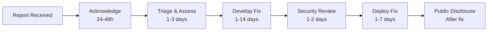
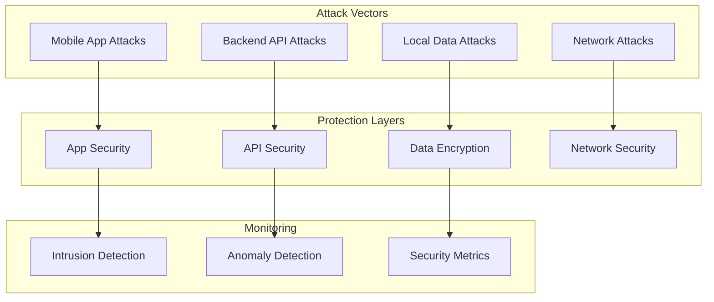
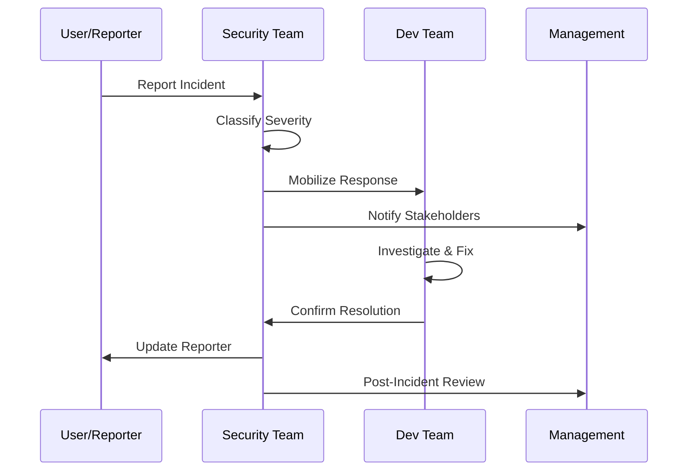

# Security Policy

> **Arkalia CIA** - Security policies and vulnerability reporting procedures

## Supported Versions

We actively maintain security updates for the following versions:

| Version | Supported | End of Life |
|---------|-----------|-------------|
| 1.x.x   | ✅ Active | TBD |
| 0.x.x   | ❌ Deprecated | 2024-12-31 |

## Reporting Vulnerabilities

We take security seriously and appreciate responsible disclosure of potential vulnerabilities.

### 🚨 Critical Vulnerabilities

For **critical security issues** that could impact user data or system integrity:

- **Email**: arkalia.luna.system@gmail.com
- **Subject**: `[CRITICAL] Arkalia CIA - Brief Description`
- **Response Time**: Within 24 hours
- **PGP Key**: Available upon request

### 📧 Standard Vulnerabilities

For **non-critical security concerns**:

- **GitHub Issues**: Create with `security` label
- **Template**: Use our security issue template
- **Response Time**: Within 48 hours

### 📋 Required Information

Please include the following details:

```markdown
## Vulnerability Details
- **Type**: [e.g., XSS, SQL Injection, Auth Bypass]
- **Severity**: [Critical/High/Medium/Low]
- **Affected Component**: [Mobile App/Backend API/Database]
- **Version(s)**: [Specific version numbers]

## Reproduction Steps
1. Step-by-step instructions
2. Include screenshots/videos if applicable
3. Minimal test case or PoC

## Impact Assessment
- What data could be compromised?
- What systems could be affected?
- Estimated user impact

## Suggested Fix
- Proposed solution (if known)
- Alternative approaches
- Related security improvements
```

## Response Process



### Timeline Commitments

| Severity | Initial Response | Fix Target | Disclosure |
|----------|-----------------|------------|------------|
| **Critical** | 24 hours | 7 days | 30 days after fix |
| **High** | 48 hours | 14 days | 60 days after fix |
| **Medium** | 72 hours | 30 days | 90 days after fix |
| **Low** | 1 week | 60 days | 120 days after fix |

## Security Architecture

### Threat Model



### Security Controls

#### Mobile Application

| Control | Implementation | Status |
|---------|----------------|--------|
| **Code Obfuscation** | Flutter build flags | ✅ |
| **Certificate Pinning** | HTTP client configuration | ✅ |
| **Local Encryption** | AES-256-GCM | ✅ |
| **Biometric Auth** | System authentication | ✅ |
| **Runtime Security** | Anti-tampering checks | 🔄 |

#### Backend Services

| Control | Implementation | Status |
|---------|----------------|--------|
| **Input Validation** | Pydantic models | ✅ |
| **SQL Injection Prevention** | ORM parameterized queries | ✅ |
| **Rate Limiting** | FastAPI middleware | ✅ |
| **Authentication** | JWT with rotation | 🔄 |
| **Authorization** | Role-based access | 🔄 |

#### Data Protection

| Control | Implementation | Status |
|---------|----------------|--------|
| **Encryption at Rest** | AES-256 database encryption | ✅ |
| **Encryption in Transit** | TLS 1.3 | ✅ |
| **Key Management** | Hardware security modules | 🔄 |
| **Data Minimization** | Local-first architecture | ✅ |
| **Secure Deletion** | Cryptographic erasure | ✅ |

## Vulnerability History

### 2024

| Date | CVE | Severity | Component | Status |
|------|-----|----------|-----------|--------|
| - | - | - | - | No vulnerabilities reported |

### Security Advisories

We publish security advisories for all significant vulnerabilities:

- **Location**: [GitHub Security Advisories](https://github.com/arkalia-luna-system/arkalia-cia/security/advisories)
- **Format**: CVE-compatible notifications
- **Distribution**: GitHub notifications, email alerts

## Security Best Practices

### For Users

```markdown
✅ **Recommended Practices**
- Keep the app updated to the latest version
- Use device lock (PIN/biometric) protection
- Enable automatic security updates
- Report suspicious behavior immediately
- Use official app stores only

❌ **Avoid These Risks**
- Installing from unofficial sources
- Sharing device access credentials
- Disabling security features
- Using public Wi-Fi for sensitive operations
```

### For Developers

```markdown
✅ **Secure Coding Guidelines**
- Validate all input data
- Use parameterized queries
- Implement proper error handling
- Follow least privilege principle
- Regular dependency updates

❌ **Security Anti-patterns**
- Hardcoded secrets in code
- Insufficient input validation
- Unencrypted sensitive data
- Overprivileged access
- Outdated dependencies
```

## Security Testing

### CodeQL Analysis

**Status**: ✅ Active - Python Only (17/11/2025)

We use GitHub's CodeQL for automated security analysis of our Python codebase:

- **Language**: Python only (JavaScript/TypeScript explicitly excluded)
- **Frequency**: On every push, pull request, and daily scheduled runs
- **Configuration**: `.github/workflows/codeql-analysis.yml`
- **Results**: Available in [Security > Code scanning](https://github.com/arkalia-luna-system/arkalia-cia/security/code-scanning)

**Why Python Only?**

- This project uses Flutter/Dart for mobile (not JavaScript)
- CodeQL Python analysis covers our backend security needs
- JavaScript analysis was disabled to prevent false positives and configuration errors

**Configuration Details**:

- Excluded paths: `**/*.js`, `**/*.jsx`, `**/*.ts`, `**/*.tsx`, `**/node_modules/**`
- Queries: `security-and-quality` (comprehensive security rules)
- Matrix strategy: Single language (`python`) to prevent auto-detection issues

### Automated Testing

```bash
# Security scanning in CI/CD
name: Security Scan
on: [push, pull_request]
jobs:
  security:
    runs-on: ubuntu-latest
    steps:
      - uses: actions/checkout@v4
      - name: Run Bandit
        run: bandit -r arkalia_cia_python_backend/
      - name: Run Safety
        run: safety scan -r requirements.txt
      - name: Run Semgrep
        run: semgrep --config=auto .
      - name: CodeQL Analysis
        uses: github/codeql-action/analyze@v4
```

### Manual Testing

| Test Type | Frequency | Scope |
|-----------|-----------|-------|
| **Penetration Testing** | Quarterly | Full application |
| **Code Review** | Every release | Security-critical changes |
| **Dependency Audit** | Monthly | All dependencies |
| **Configuration Review** | Bi-annually | Infrastructure & deployment |

## Incident Response

### Security Incident Classification

| Level | Criteria | Response Team | Max Response Time |
|-------|----------|---------------|-------------------|
| **P0 - Critical** | Active data breach | Full team + external | 1 hour |
| **P1 - High** | Potential data exposure | Security team + leads | 4 hours |
| **P2 - Medium** | Service disruption | Security team | 24 hours |
| **P3 - Low** | Minor security concern | Security team | 72 hours |

### Response Procedures



## Compliance & Standards

### Security Frameworks

- **OWASP Mobile Top 10**: Full compliance
- **OWASP API Security Top 10**: Full compliance
- **NIST Cybersecurity Framework**: Core implementation
- **ISO 27001**: Aligned practices

### Privacy Regulations

- **GDPR**: Privacy by design implementation
- **CCPA**: Data minimization compliance
- **HIPAA**: Healthcare data protection (where applicable)

## Security Contacts

### Primary Contacts

- **Security Team**: arkalia.luna.system@gmail.com
- **Emergency**: arkalia.luna.system@gmail.com (24/7)
- **GPG Key**: [Request via arkalia.luna.system@gmail.com]

### Security Champions

| Role | Contact | Expertise |
|------|---------|-----------|
| **Security Lead** | TBD | Overall security strategy |
| **Mobile Security** | TBD | iOS/Android security |
| **Backend Security** | TBD | API & infrastructure |
| **DevSecOps** | TBD | CI/CD & automation |

## Acknowledgments

We thank the following security researchers for responsible disclosure:

| Researcher | Date | Vulnerability Type |
|------------|------|-------------------|
| - | - | No reports yet |

*Want to be listed here? Report a security vulnerability responsibly!*

---

**Last Updated**: November 2025
**Next Review**: February 2026

*This security policy is reviewed quarterly and updated as needed. For questions, contact arkalia.luna.system@gmail.com.*
