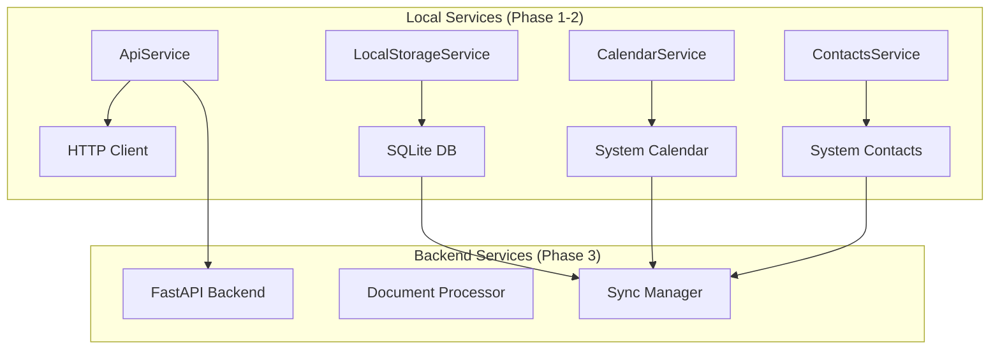
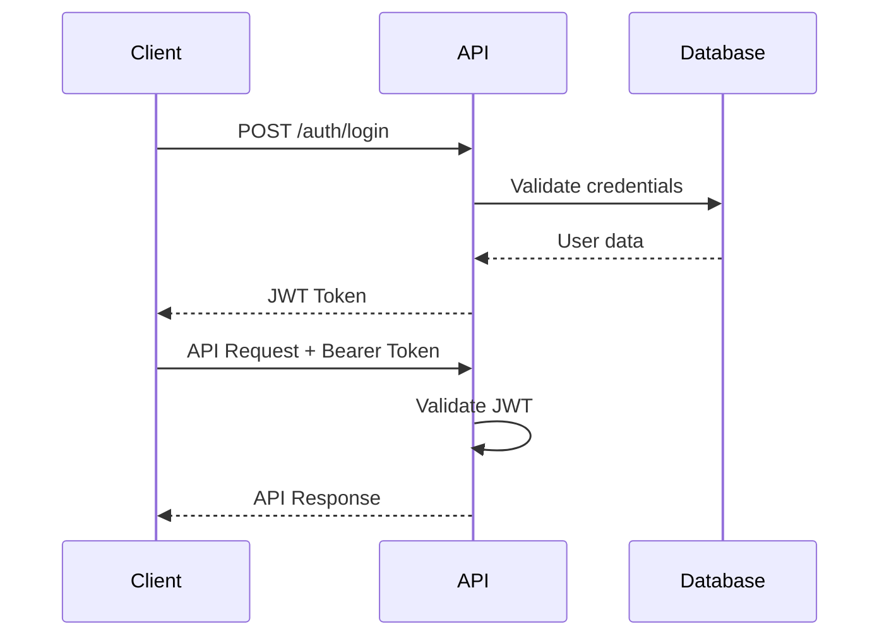

# API Reference

> **Arkalia CIA** - Comprehensive service APIs and integration guide

**Last Updated**: November 19, 2025  
**Version**: 1.2.0  
**Status**: ✅ **Production Ready**

---

## 📋 Table of Contents

1. [Overview](#overview)
2. [Service Architecture](#service-architecture)
3. [Local Services](#local-services)
4. [Backend API](#backend-api)
5. [Error Handling](#error-handling)
6. [Authentication](#authentication)
7. [Rate Limiting](#rate-limiting)
8. [Best Practices](#best-practices)

---

## Overview

Arkalia CIA implements a **hybrid API architecture** combining local services for offline functionality with optional backend APIs for advanced features. All APIs prioritize data privacy and minimal network dependency.

## Service Architecture



## Local Services

### ApiService

Central HTTP client for backend communication.

**Configuration**:
```dart
class ApiService {
  static const String baseUrl = 'http://localhost:8000';
  static const Duration timeout = Duration(seconds: 30);

  static Map<String, String> get _headers => {
    'Content-Type': 'application/json',
    'Accept': 'application/json',
  };
}
```

#### Document Operations

**Upload Document**
```dart
static Future<Map<String, dynamic>> uploadDocument(File pdfFile) async
```

**Example Usage**:
```dart
File document = File('/path/to/document.pdf');
try {
  Map<String, dynamic> result = await ApiService.uploadDocument(document);
  print('Document uploaded: ${result['filename']}');
} catch (e) {
  debugPrint('Upload failed: $e');
}
```

**Response Format**:
```json
{
  "id": 123,
  "filename": "document_20241213_143000.pdf",
  "original_name": "medical_report.pdf",
  "file_size": 2048576,
  "file_type": "application/pdf",
  "created_at": "2024-12-13T14:30:00Z"
}
```

**Get Documents**
```dart
static Future<List<Map<String, dynamic>>> getDocuments() async
```

**Example Response**:
```json
[
  {
    "id": 1,
    "name": "Medical Report 2024",
    "original_name": "report.pdf",
    "file_path": "/documents/report_20241213.pdf",
    "file_size": 1024000,
    "created_at": "2024-12-13T10:00:00Z",
    "category": "medical"
  }
]
```

**Delete Document**
```dart
static Future<bool> deleteDocument(int documentId) async
```

#### Reminder Operations

**Create Reminder**
```dart
static Future<Map<String, dynamic>> createReminder({
  required String title,
  required String description,
  required String reminderDate,
}) async
```

**Example Usage**:
```dart
await ApiService.createReminder(
  title: 'Doctor Appointment',
  description: 'Annual checkup with Dr. Smith',
  reminderDate: '2024-12-20T09:00:00Z',
);
```

**Get Reminders**
```dart
static Future<List<Map<String, dynamic>>> getReminders() async
```

#### Contact Operations

**Create Emergency Contact**
```dart
static Future<Map<String, dynamic>> createEmergencyContact({
  required String name,
  required String phone,
  required String relationship,
}) async
```

**Get Emergency Contacts**
```dart
static Future<List<Map<String, dynamic>>> getEmergencyContacts() async
```

### LocalStorageService

Secure local data persistence with encryption.

#### Core Methods

**Initialization**
```dart
static Future<void> init() async
```

**Document Management**
```dart
// Save document
static Future<void> saveDocument(Map<String, dynamic> document) async

// Retrieve documents
static Future<List<Map<String, dynamic>>> getDocuments() async

// Delete document
static Future<void> deleteDocument(int id) async
```

**Example Usage**:
```dart
// Initialize service
await LocalStorageService.init();

// Save document
Map<String, dynamic> document = {
  'name': 'Medical Report',
  'path': '/storage/documents/report.pdf',
  'size': 1024000,
  'category': 'medical',
  'encrypted': true,
};
await LocalStorageService.saveDocument(document);

// Retrieve documents
List<Map<String, dynamic>> documents = await LocalStorageService.getDocuments();
```

#### Data Models

**Document Schema**
```dart
{
  'id': int,
  'name': String,
  'path': String,
  'size': int,
  'created_at': String,          // ISO 8601 format
  'category': String?,           // Optional category
  'encrypted': bool,             // Encryption status
  'hash': String?                // File integrity hash
}
```

**Reminder Schema**
```dart
{
  'id': int,
  'title': String,
  'description': String?,
  'reminder_date': String,       // ISO 8601 format
  'is_completed': bool,
  'created_at': String,
  'recurring': bool,
  'recurring_pattern': String?   // 'daily', 'weekly', 'monthly'
}
```

**Contact Schema**
```dart
{
  'id': int,
  'name': String,
  'phone': String,
  'relationship': String,
  'is_ice': bool,               // In Case of Emergency
  'created_at': String,
  'notes': String?
}
```

### CalendarService

Native calendar integration for reminder management.

#### Core Operations

**Initialization**
```dart
static Future<void> init() async
```

**Add Reminder**
```dart
static Future<void> addReminder({
  required String title,
  required String description,
  required DateTime reminderDate,
}) async
```

**Example Usage**:
```dart
await CalendarService.addReminder(
  title: 'Take Medication',
  description: 'Morning blood pressure medication',
  reminderDate: DateTime(2024, 12, 20, 8, 0),
);
```

**Get Upcoming Events**
```dart
static Future<List<Event>> getUpcomingEvents() async
```

**Schedule Notification**
```dart
static Future<void> scheduleNotification({
  required String title,
  required String description,
  required DateTime date,
}) async
```

### ContactsService

System contacts integration for emergency features.

#### Contact Management

**Get Contacts**
```dart
static Future<List<Contact>> getContacts() async
```

**Get Emergency Contacts**
```dart
static Future<List<Contact>> getEmergencyContacts() async
```

**Make Phone Call**
```dart
static Future<bool> makeCall(String phoneNumber) async
```

**Example Usage**:
```dart
// Get emergency contacts
List<Contact> emergencyContacts = await ContactsService.getEmergencyContacts();

// Make emergency call
bool callSuccess = await ContactsService.makeCall('+1234567890');
if (callSuccess) {
  print('Emergency call initiated');
}
```

## Backend API (Phase 3)

### FastAPI Endpoints

Base URL: `http://localhost:8000`

### ARIA Integration

Arkalia CIA intègre maintenant **ARKALIA ARIA** (Research Intelligence Assistant) pour des fonctionnalités avancées de suivi de santé et d'analyse de données.

#### Configuration ARIA

**Base URL ARIA**: `http://localhost:8001`

**Endpoints d'intégration**:
- `/api/aria/status` - Statut de l'intégration ARIA
- `/api/aria/quick-pain-entry` - Saisie rapide de douleur
- `/api/aria/pain-entry` - Saisie détaillée de douleur
- `/api/aria/pain-entries` - Historique des entrées
- `/api/aria/export/csv` - Export CSV pour professionnels
- `/api/aria/patterns/recent` - Patterns récents
- `/api/aria/predictions/current` - Prédictions actuelles

#### Exemple d'utilisation ARIA

**Saisie rapide de douleur**:
```dart
Map<String, dynamic> painData = {
  'intensity': 7,
  'trigger': 'stress',
  'action': 'respiration'
};

Map<String, dynamic> result = await ApiService.post(
  '/api/aria/quick-pain-entry',
  data: painData
);
```

**Récupération de l'historique**:
```dart
List<Map<String, dynamic>> history = await ApiService.get(
  '/api/aria/pain-entries/recent?limit=10'
);
```

**Export pour professionnel de santé**:
```dart
Map<String, dynamic> export = await ApiService.get(
  '/api/aria/export/csv'
);
String csvContent = export['content'];
String filename = export['filename'];
```

#### Health Check

**GET** `/health`

**Response**:
```json
{
  "status": "healthy",
  "timestamp": "2024-12-13T14:30:00Z",
  "version": "1.0.0"
}
```

#### Document Endpoints

**POST** `/api/documents/upload`

**Request**: Multipart form with PDF file

**Response**:
```json
{
  "id": 123,
  "filename": "document_20241213_143000.pdf",
  "original_name": "report.pdf",
  "file_size": 2048576,
  "file_type": "application/pdf",
  "created_at": "2024-12-13T14:30:00Z"
}
```

**GET** `/api/documents`

**Response**:
```json
[
  {
    "id": 1,
    "name": "Medical Report",
    "original_name": "report.pdf",
    "file_path": "/uploads/report_20241213.pdf",
    "file_type": "application/pdf",
    "file_size": 1024000,
    "created_at": "2024-12-13T10:00:00Z"
  }
]
```

**GET** `/api/documents/{doc_id}`

**DELETE** `/api/documents/{doc_id}`

#### Reminder Endpoints

**POST** `/api/reminders`

**Request Body**:
```json
{
  "title": "Doctor Appointment",
  "description": "Annual checkup",
  "reminder_date": "2024-12-20T09:00:00Z"
}
```

**GET** `/api/reminders`

**PUT** `/api/reminders/{reminder_id}`

**DELETE** `/api/reminders/{reminder_id}`

#### Contact Endpoints

**POST** `/api/contacts`

**Request Body**:
```json
{
  "name": "Dr. Smith",
  "phone": "+1234567890",
  "relationship": "primary_doctor",
  "is_ice": true
}
```

**GET** `/api/contacts`

**PUT** `/api/contacts/{contact_id}`

**DELETE** `/api/contacts/{contact_id}`

## Error Handling

### Error Response Format

```json
{
  "error": {
    "code": "VALIDATION_ERROR",
    "message": "Invalid input data",
    "details": {
      "field": "reminder_date",
      "issue": "Invalid date format"
    },
    "timestamp": "2024-12-13T14:30:00Z"
  }
}
```

### Error Codes

| Code | Description | HTTP Status |
|------|-------------|-------------|
| `VALIDATION_ERROR` | Input validation failed | 400 |
| `NOT_FOUND` | Resource not found | 404 |
| `PERMISSION_DENIED` | Access denied | 403 |
| `RATE_LIMITED` | Too many requests | 429 |
| `SERVER_ERROR` | Internal server error | 500 |

### Exception Handling

```dart
try {
  List<Map<String, dynamic>> documents = await ApiService.getDocuments();
} on HttpException catch (e) {
  if (e.statusCode == 404) {
    debugPrint('No documents found');
  } else {
    debugPrint('HTTP Error: ${e.message}');
  }
} on SocketException catch (e) {
  debugPrint('Network error: $e');
} catch (e) {
  debugPrint('Unexpected error: $e');
}
```

## Authentication (Phase 3)

### JWT Token Flow



### Token Usage

```dart
// Store token securely
await SecureStorage.store('auth_token', token);

// Add to API headers
static Map<String, String> get _authHeaders => {
  'Authorization': 'Bearer ${SecureStorage.get("auth_token")}',
  'Content-Type': 'application/json',
};
```

## Security

### Encryption

**Local Data Encryption**:
- Algorithm: AES-256-GCM
- Key derivation: PBKDF2
- Storage: Keychain (iOS) / Keystore (Android)

**API Security**:
- HTTPS/TLS 1.3 for all communications
- JWT tokens with short expiration
- Rate limiting per client
- Input validation and sanitization

### Permissions

| Service | Required Permissions | Justification |
|---------|---------------------|---------------|
| Calendar | Read/Write events | Reminder functionality |
| Contacts | Read contact info | Emergency contacts |
| Storage | App-specific files | Document storage |
| Network | Internet access | Backend sync (Phase 3) |

## Testing

### Unit Test Examples

```dart
group('ApiService', () {
  test('should upload document successfully', () async {
    // Mock HTTP client
    final mockClient = MockClient();

    // Test document upload
    File testFile = File('test_document.pdf');
    Map<String, dynamic> result = await ApiService.uploadDocument(testFile);

    expect(result['filename'], isNotNull);
    expect(result['file_size'], greaterThan(0));
  });

  test('should handle network errors gracefully', () async {
    // Test network error handling
    expect(
      () => ApiService.getDocuments(),
      throwsA(isA<SocketException>()),
    );
  });
});
```

### Integration Test Examples

```dart
group('End-to-End Document Flow', () {
  testWidgets('should upload and retrieve document', (tester) async {
    // Test complete document workflow
    await tester.pumpWidget(MyApp());

    // Upload document
    await tester.tap(find.byKey(Key('upload_button')));
    await tester.pumpAndSettle();

    // Verify document appears in list
    expect(find.text('test_document.pdf'), findsOneWidget);
  });
});
```

## Performance

### Response Time Targets

| Operation | Target | Timeout |
|-----------|--------|---------|
| Document upload | < 5s | 30s |
| Document list | < 500ms | 10s |
| Reminder create | < 200ms | 5s |
| Contact sync | < 1s | 15s |

### Caching Strategy

```dart
class ApiCache {
  static final Map<String, CacheEntry> _cache = {};
  static const Duration defaultTTL = Duration(minutes: 5);

  static Future<T?> get<T>(String key) async {
    CacheEntry? entry = _cache[key];
    if (entry?.isExpired ?? true) return null;
    return entry!.data as T;
  }

  static void set<T>(String key, T data, [Duration? ttl]) {
    _cache[key] = CacheEntry(data, ttl ?? defaultTTL);
  }
}
```

## 📚 Related Documentation

- **[ARCHITECTURE.md](ARCHITECTURE.md)** - System architecture
- **[DEPLOYMENT.md](DEPLOYMENT.md)** - Deployment procedures
- **[CONTRIBUTING.md](CONTRIBUTING.md)** - Development guidelines
- **[INDEX_DOCUMENTATION.md](INDEX_DOCUMENTATION.md)** - Full documentation index

---

**Last Updated**: November 19, 2025  
*This API reference is maintained alongside code changes and updated with each release.*
