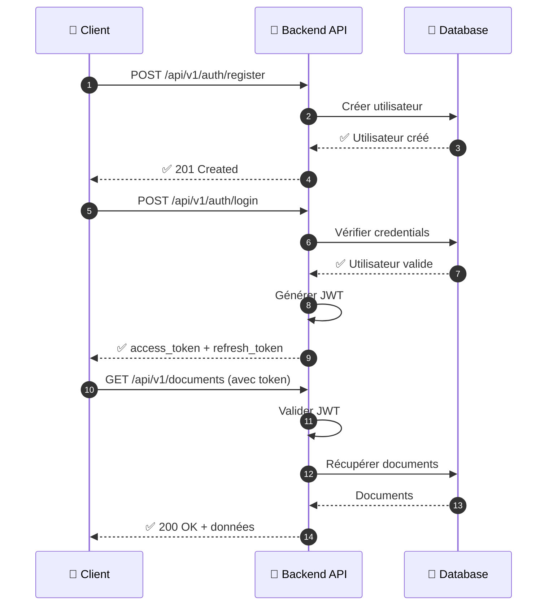
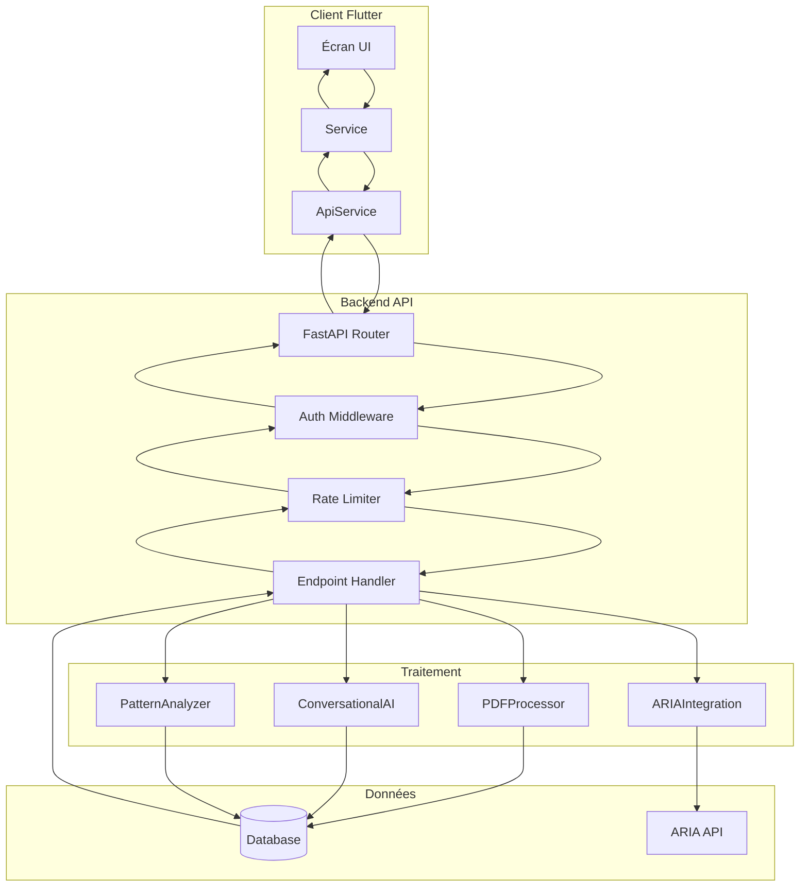

# 🔌 Documentation API — Arkalia CIA

<div align="center">

**Version** : 1.3.1+6 | **Date** : 12 décembre 2025

[]()
[]()
[]()

</div>

**Base URL** : `http://localhost:8000` (dev) ou configurée via `BackendConfigService`  
**Version API** : `/api/v1/`  
**Total** : 36 endpoints (28 API principale + 8 ARIA Integration)

---

## Table des matières

1. [Authentification](#authentification)
2. [Endpoints Documents](#endpoints-documents)
3. [Endpoints Médecins](#endpoints-médecins)
4. [Endpoints Rappels](#endpoints-rappels)
5. [Endpoints Contacts Urgence](#endpoints-contacts-urgence)
6. [Endpoints Portails Santé](#endpoints-portails-santé)
7. [Endpoints Rapports Médicaux](#endpoints-rapports-médicaux)
8. [Endpoints IA](#endpoints-ia)
9. [Endpoints Patterns](#endpoints-patterns)
10. [Endpoints ARIA Integration](#endpoints-aria-integration)
11. [Gestion d'erreurs](#gestion-derreurs)
12. [Rate Limiting](#rate-limiting)

---

## Authentification

Tous les endpoints (sauf `/`, `/health` et `/api/v1/auth/*`) nécessitent une authentification via token JWT.

### Flux d'authentification



### Inscription

```http
POST /api/v1/auth/register
Content-Type: application/json

{
  "username": "utilisateur",
  "email": "user@example.com",
  "password": "motdepasse123"
}
```

**Réponse** :
```json
{
  "id": 1,
  "username": "utilisateur",
  "email": "user@example.com",
  "created_at": "2025-01-20T10:00:00"
}
```

### Connexion

```http
POST /api/v1/auth/login
Content-Type: application/json

{
  "username": "utilisateur",
  "password": "motdepasse123"
}
```

**Réponse** :
```json
{
  "access_token": "eyJhbGciOiJIUzI1NiIsInR5cCI6IkpXVCJ9...",
  "refresh_token": "eyJhbGciOiJIUzI1NiIsInR5cCI6IkpXVCJ9...",
  "token_type": "bearer"
}
```

### Rafraîchir le token

```http
POST /api/v1/auth/refresh
Content-Type: application/json

{
  "refresh_token": "eyJhbGciOiJIUzI1NiIsInR5cCI6IkpXVCJ9..."
}
```

### Utiliser le token

Ajouter dans les headers de toutes les requêtes authentifiées :

```
Authorization: Bearer <access_token>
```

---

## Endpoints Documents

### Upload document

```http
POST /api/v1/documents/upload
Content-Type: multipart/form-data
Authorization: Bearer <token>

file: <fichier PDF>
category: examen|ordonnance|consultation|autre
```

**Réponse** :
```json
{
  "success": true,
  "document_id": 123,
  "message": "Document uploadé avec succès",
  "metadata": {
    "doctor_name": "Dr. Dupont",
    "document_date": "2025-01-15",
    "exam_type": "Analyse sanguine"
  }
}
```

**Traitement** :
- Extraction texte PDF
- OCR automatique si PDF scanné
- Extraction métadonnées (médecin, date, type)
- Association automatique avec médecin si trouvé

### Liste documents

```http
GET /api/v1/documents?skip=0&limit=50
Authorization: Bearer <token>
```

**Paramètres** :
- `skip` (int, optionnel) : Nombre de documents à ignorer (défaut: 0)
- `limit` (int, optionnel) : Nombre maximum (défaut: 50, max: 100)

**Réponse** :
```json
[
  {
    "id": 1,
    "original_name": "examen_sanguin.pdf",
    "file_path": "uploads/user_1/doc_1.pdf",
    "category": "examen",
    "created_at": "2025-01-20T10:00:00",
    "metadata": {
      "doctor_name": "Dr. Martin",
      "document_date": "2025-01-15",
      "exam_type": "Analyse sanguine"
    }
  }
]
```

### Récupérer document

```http
GET /api/v1/documents/{doc_id}
Authorization: Bearer <token>
```

**Réponse** : Document complet avec métadonnées

### Supprimer document

```http
DELETE /api/v1/documents/{doc_id}
Authorization: Bearer <token>
```

**Réponse** :
```json
{
  "success": true,
  "message": "Document supprimé avec succès"
}
```

---

## Endpoints Médecins

Les médecins sont gérés côté client (Flutter) via `DoctorService` et stockés localement en SQLite. Pas d'endpoints backend dédiés actuellement.

---

## Endpoints Rappels

### Créer rappel

```http
POST /api/v1/reminders
Content-Type: application/json
Authorization: Bearer <token>

{
  "title": "Prise médicament",
  "description": "Prendre médicament X",
  "reminder_date": "2025-01-25T08:00:00",
  "is_recurring": true,
  "recurrence_pattern": "daily"
}
```

**Réponse** :
```json
{
  "id": 1,
  "title": "Prise médicament",
  "reminder_date": "2025-01-25T08:00:00",
  "is_recurring": true,
  "created_at": "2025-01-20T10:00:00"
}
```

### Liste rappels

```http
GET /api/v1/reminders?skip=0&limit=50
Authorization: Bearer <token>
```

**Paramètres** : `skip`, `limit` (pagination)

---

## Endpoints Contacts Urgence

### Créer contact urgence

```http
POST /api/v1/emergency-contacts
Content-Type: application/json
Authorization: Bearer <token>

{
  "name": "Jean Dupont",
  "phone": "+32470123456",
  "relationship": "Fils",
  "is_ice": true
}
```

### Liste contacts urgence

```http
GET /api/v1/emergency-contacts?skip=0&limit=50
Authorization: Bearer <token>
```

---

## Endpoints Portails Santé

### Créer portail santé

```http
POST /api/v1/health-portals
Content-Type: application/json
Authorization: Bearer <token>

{
  "name": "eHealth",
  "portal_type": "ehealth",
  "access_token": "token_oauth"
}
```

### Liste portails santé

```http
GET /api/v1/health-portals?skip=0&limit=50
Authorization: Bearer <token>
```

### Importer depuis portail

```http
POST /api/v1/health-portals/import
Content-Type: application/json
Authorization: Bearer <token>

{
  "portal": "eHealth",
  "data": {
    "documents": [...],
    "consultations": [...],
    "exams": [...]
  }
}
```

**Réponse** :
```json
{
  "success": true,
  "documents_imported": 15,
  "consultations_imported": 8,
  "exams_imported": 12
}
```

---

## Endpoints IA

### Chat conversationnel

```http
POST /api/v1/ai/chat
Content-Type: application/json
Authorization: Bearer <token>

{
  "question": "Quels sont mes derniers examens ?",
  "user_data": {
    "documents": [...],
    "doctors": [...],
    "consultations": [...],
    "pain_records": [...]
  }
}
```

**Réponse** :
```json
{
  "answer": "Voici vos derniers examens...",
  "related_documents": [1, 2, 3],
  "suggestions": [
    "Quand était mon dernier examen ?",
    "Quels médecins ai-je consultés récemment ?"
  ],
  "patterns_detected": {
    "type": "temporal",
    "description": "Examens plus fréquents en hiver"
  },
  "question_type": "exam"
}
```

**Types de questions supportées** :
- `exam` : Questions sur examens
- `doctor` : Questions sur médecins
- `pain` : Questions sur douleurs (avec intégration ARIA)
- `medication` : Questions sur médicaments
- `appointment` : Questions sur rendez-vous
- `cause_effect` : Analyse cause-effet (avec ARIA)

### Historique conversations

```http
GET /api/v1/ai/conversations?limit=20
Authorization: Bearer <token>
```

**Réponse** :
```json
[
  {
    "id": 1,
    "question": "Quels sont mes derniers examens ?",
    "answer": "Voici vos derniers examens...",
    "question_type": "exam",
    "created_at": "2025-01-20T10:00:00"
  }
]
```

### Préparer rendez-vous

```http
POST /api/v1/ai/prepare-appointment
Content-Type: application/json
Authorization: Bearer <token>

{
  "doctor_id": "doc123",
  "user_data": {
    "consultations": [...],
    "doctors": [...],
    "documents": [...]
  }
}
```

**Réponse** :
```json
{
  "questions": [
    "Quels sont vos symptômes actuels ?",
    "Avez-vous pris vos médicaments régulièrement ?",
    "Y a-t-il eu des changements depuis la dernière consultation ?"
  ],
  "suggestions": [
    "Apporter les derniers examens",
    "Noter les questions avant le rendez-vous"
  ]
}
```

---

## Endpoints Rapports Médicaux

### Générer rapport médical pré-consultation

```http
POST /api/v1/medical-reports/generate
Content-Type: application/json
Authorization: Bearer <token>

{
  "consultation_date": "2025-12-01T10:00:00Z",
  "days_range": 30,
  "include_aria": true
}
```

**Paramètres** :
- `consultation_date` (string, optionnel) : Date de consultation au format ISO (défaut: aujourd'hui)
- `days_range` (int, optionnel) : Nombre de jours à inclure (défaut: 30, min: 1, max: 365)
- `include_aria` (bool, optionnel) : Inclure les données ARIA si disponibles (défaut: true)

**Réponse** :
```json
{
  "success": true,
  "report_date": "2025-12-01T10:00:00Z",
  "generated_at": "2025-11-23T14:30:00Z",
  "days_range": 30,
  "sections": {
    "documents": {
      "title": "DOCUMENTS MÉDICAUX (CIA)",
      "items": [
        {
          "name": "Analyse sanguine.pdf",
          "date": "2025-11-15T00:00:00Z",
          "type": "Examen",
          "description": ""
        }
      ],
      "count": 5
    },
    "consultations": {
      "title": "CONSULTATIONS RÉCENTES",
      "items": [],
      "count": 0
    },
    "aria": {
      "title": "DONNÉES ARIA (30 derniers jours)",
      "pain_timeline": {
        "average_intensity": 6.2,
        "max_intensity": 8,
        "peak_pain": {
          "intensity": 8,
          "date": "2025-11-12T14:30:00Z"
        },
        "most_common_location": "Genou droit",
        "location_percentage": 78,
        "most_common_triggers": [
          {
            "trigger": "Activité physique",
            "count": 15,
            "percentage": 45
          }
        ],
        "total_entries": 33
      },
      "patterns": {
        "sleep_correlation": {
          "correlation": 0.78,
          "description": "Douleur ↑ de 40% les jours où sommeil <6h"
        }
      },
      "health_metrics": {
        "sleep": {
          "avg_30d": 6.2,
          "target": 7.0,
          "trend": "↓ -0.5h vs mois précédent"
        }
      }
    }
  },
  "formatted_text": "RAPPORT MÉDICAL - Consultation du 01/12/2025\n============================================\n\nDOCUMENTS MÉDICAUX (CIA)\n- Analyse sanguine.pdf (Examen) - 15/11/2025\n..."
}
```

**Fonctionnalités** :
- Combine automatiquement données CIA (documents) + ARIA (douleur, patterns, métriques)
- Graceful degradation : fonctionne même si ARIA n'est pas disponible
- Format texte structuré prêt pour partage (email, messages, etc.)
- Export PDF prévu en Phase 2

**Rate limiting** : 10 requêtes par minute

---

## Endpoints Patterns

### Analyser patterns

```http
POST /api/v1/patterns/analyze
Content-Type: application/json
Authorization: Bearer <token>

{
  "data": {
    "pain_records": [...],
    "consultations": [...],
    "medications": [...]
  }
}
```

**Réponse** :
```json
{
  "patterns": [
    {
      "type": "temporal",
      "description": "Douleurs plus fréquentes en hiver",
      "confidence": 0.85,
      "frequency": "monthly"
    }
  ],
  "trends": {
    "direction": "increasing",
    "description": "Augmentation des consultations"
  },
  "seasonality": {
    "peak_months": [11, 12, 1],
    "description": "Pic en hiver"
  }
}
```

### Prédire événements futurs

```http
POST /api/v1/patterns/predict-events
Content-Type: application/json
Authorization: Bearer <token>

{
  "data": {
    "pain_records": [...],
    "consultations": [...]
  },
  "prediction_days": 30
}
```

**Réponse** :
```json
{
  "predictions": [
    {
      "date": "2025-02-15",
      "event_type": "pain_episode",
      "probability": 0.75,
      "confidence": 0.82
    }
  ],
  "model": "prophet",
  "accuracy": 0.78
}
```

---

## Endpoints ARIA Integration

Les endpoints ARIA permettent d'intégrer les données de douleur et de patterns depuis Arkalia ARIA.

**Base URL ARIA** : `http://127.0.0.1:8001` (port différent de CIA)  
**Préfixe** : `/api/aria/`

### Statut ARIA

```http
GET /api/aria/status
```

Vérifie si ARIA est disponible et accessible.

**Réponse** :
```json
{
  "status": "online",
  "version": "1.0.0"
}
```

### Entrée douleur rapide

```http
POST /api/aria/quick-pain-entry
Content-Type: application/json
Authorization: Bearer <token>

{
  "intensity": 7,
  "location": "Dos"
}
```

### Entrée douleur complète

```http
POST /api/aria/pain-entry
Content-Type: application/json
Authorization: Bearer <token>

{
  "intensity": 7,
  "physical_trigger": "Mouvement",
  "mental_trigger": "Stress",
  "activity": "Assis",
  "location": "Dos",
  "action_taken": "Médicament",
  "effectiveness": 8,
  "notes": "Douleur après longue période assise",
  "timestamp": "2025-12-12T10:00:00"
}
```

### Liste entrées douleur

```http
GET /api/aria/pain-entries
Authorization: Bearer <token>
```

Récupère toutes les entrées de douleur.

### Entrées récentes

```http
GET /api/aria/pain-entries/recent
Authorization: Bearer <token>
```

Récupère les entrées de douleur récentes (30 derniers jours).

### Export CSV

```http
GET /api/aria/export/csv
Authorization: Bearer <token>
```

Exporte les données de douleur en CSV.

### Patterns récents

```http
GET /api/aria/patterns/recent
Authorization: Bearer <token>
```

Récupère les patterns de douleur détectés récemment.

### Prédictions actuelles

```http
GET /api/aria/predictions/current
Authorization: Bearer <token>
```

Récupère les prédictions de douleur actuelles basées sur les patterns.

**Note** : Tous les endpoints ARIA nécessitent une authentification JWT et communiquent avec l'instance ARIA locale sur le port 8001.

---

## Gestion d'erreurs

### Codes de statut HTTP

| Code | Signification |
|------|--------------|
| `200` | Succès |
| `201` | Créé avec succès |
| `400` | Requête invalide |
| `401` | Non authentifié |
| `403` | Accès interdit |
| `404` | Ressource non trouvée |
| `422` | Erreur de validation |
| `429` | Trop de requêtes (rate limit) |
| `500` | Erreur serveur |

### Format d'erreur

```json
{
  "detail": "Message d'erreur détaillé",
  "error_code": "VALIDATION_ERROR",
  "field": "email"
}
```

---

## Rate Limiting

Tous les endpoints sont protégés par un rate limiting :

| Endpoint | Limite |
|----------|--------|
| `/api/v1/medical-reports/generate` | 10/minute |
| `/api/v1/ai/chat` | 30/minute |
| `/api/v1/patterns/analyze` | 30/minute |
| Autres endpoints | 60/minute |

**Limites globales** :
- **Par IP** : 100 requêtes/minute
- **Par utilisateur** : 200 requêtes/minute

En cas de dépassement, réponse `429 Too Many Requests` avec header `Retry-After`.

---

## Schéma de flux complet



---

## Voir aussi

- **[API.md](./API.md)** — Documentation API (version simplifiée)
- **[ARCHITECTURE.md](./ARCHITECTURE.md)** — Architecture système détaillée
- **[guides/GUIDE_MISE_A_JOUR_FLUTTER.md](./guides/GUIDE_MISE_A_JOUR_FLUTTER.md)** — Guide mise à jour Flutter
- **[audits/CHECKLIST_FINALE_SECURITE.md](./audits/CHECKLIST_FINALE_SECURITE.md)** — Checklist sécurité
- **[INDEX_DOCUMENTATION.md](./INDEX_DOCUMENTATION.md)** — Index complet de la documentation

---

*Dernière mise à jour : 12 décembre 2025*
