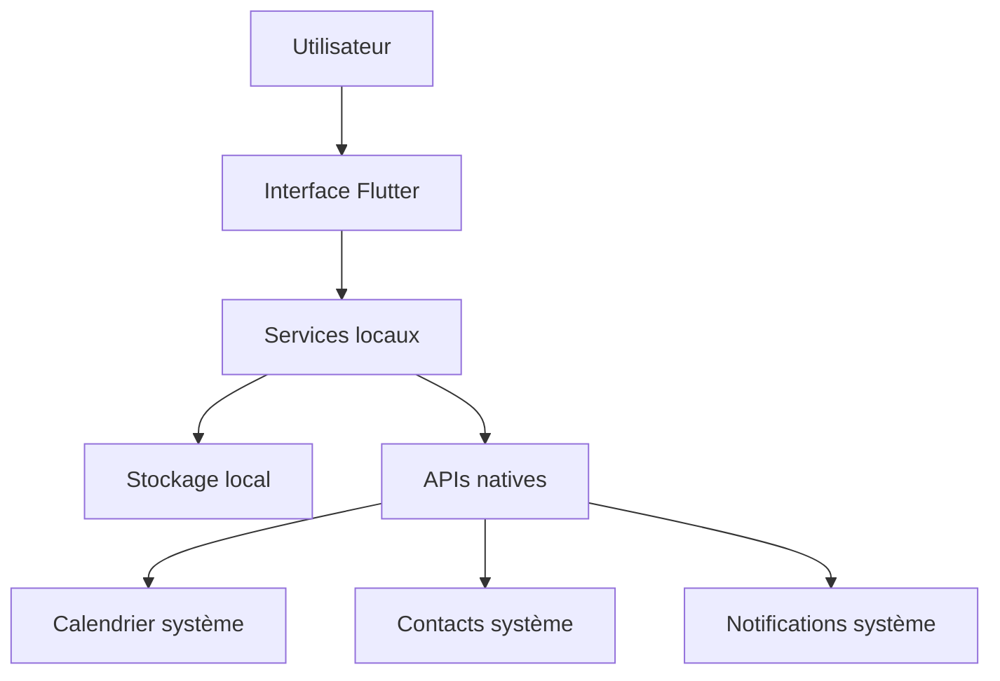
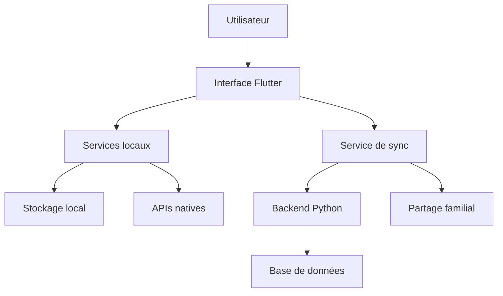

# 🏗️ Architecture - Arkalia CIA

## Vue d'ensemble

Arkalia CIA suit une architecture **local-first** qui privilégie la simplicité, la fiabilité et la confidentialité. L'application fonctionne entièrement sur le téléphone sans dépendance externe.

## Principes architecturaux

### 1. Local-First
- Toutes les données sont stockées localement
- Aucune dépendance réseau pour le fonctionnement de base
- Synchronisation optionnelle en Phase 3

### 2. Intégration native
- Utilise les APIs natives du système d'exploitation
- Calendrier, contacts, notifications du téléphone
- Expérience utilisateur familière

### 3. Sécurité par défaut
- Chiffrement local des données sensibles
- Aucune donnée en clair
- Permissions minimales

## Architecture technique

### Frontend Flutter

```
lib/
├── main.dart                 # Point d'entrée
├── screens/                  # Écrans de l'application
│   ├── home_page.dart       # Écran principal
│   ├── documents_screen.dart # Gestion documents
│   ├── health_screen.dart   # Portails santé
│   ├── reminders_screen.dart # Rappels et calendrier
│   └── emergency_screen.dart # Contacts d'urgence
└── services/                 # Services locaux
    ├── local_storage_service.dart # Stockage local
    ├── calendar_service.dart      # Intégration calendrier
    ├── contacts_service.dart      # Gestion contacts
    └── notification_service.dart  # Notifications
```

### Backend Python (Phase 3)

```
arkalia_cia_python_backend/
├── api.py                   # API FastAPI
├── database.py              # Gestion base de données
├── pdf_processor.py         # Traitement PDF
├── security_dashboard.py    # Tableau de bord sécurité
└── storage.py               # Gestion stockage
```

## Flux de données

### Phase 1 : Local uniquement



### Phase 3 : Avec synchronisation



## Services principaux

### LocalStorageService
- Stockage sécurisé des données
- Chiffrement AES-256
- Gestion des documents, rappels, contacts

### CalendarService
- Intégration calendrier natif
- Création d'événements
- Notifications de rappels

### ContactsService
- Accès aux contacts du téléphone
- Gestion des contacts ICE
- Appels directs

### NotificationService
- Notifications locales
- Rappels programmés
- Alertes d'urgence

## Sécurité

### Chiffrement
- **Algorithme** : AES-256
- **Clé** : Générée localement
- **Stockage** : Keychain (iOS) / Keystore (Android)

### Permissions
- **Calendrier** : Lecture/écriture des événements
- **Contacts** : Lecture des contacts
- **Stockage** : Accès aux fichiers de l'app
- **Notifications** : Envoi de notifications

### Données sensibles
- Documents médicaux chiffrés
- Informations de contact protégées
- Aucune donnée transmise sans consentement

## Évolutivité

### Phase 1 : MVP Local
- Fonctionnalités de base
- Stockage local uniquement
- Interface simple

### Phase 2 : Intelligence locale
- Suggestions contextuelles
- Reconnaissance vocale
- Widgets système

### Phase 3 : Écosystème connecté
- Synchronisation cloud
- Partage familial
- Intégration robot

## Performance

### Optimisations
- Chargement paresseux des données
- Cache local intelligent
- Compression des documents
- Interface réactive

### Limites
- Stockage limité par l'appareil
- Pas de synchronisation temps réel
- Dépendance aux APIs natives

## Maintenance

### Tests
- Tests unitaires pour chaque service
- Tests d'intégration avec les APIs natives
- Tests de performance

### Monitoring
- Logs locaux
- Métriques d'utilisation
- Rapports d'erreurs

### Mises à jour
- Mises à jour via les stores
- Migration des données locales
- Rétrocompatibilité
