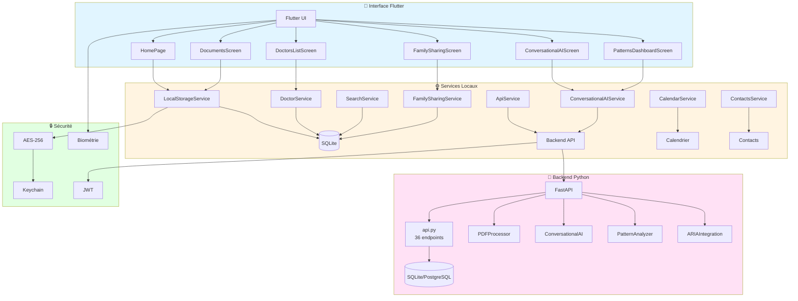
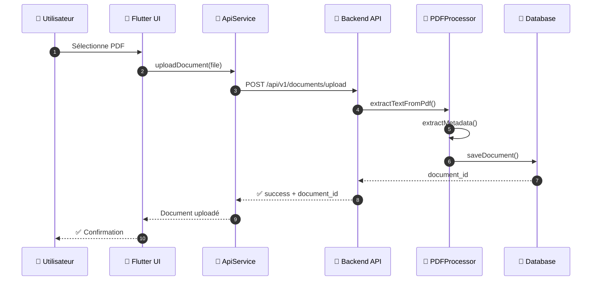
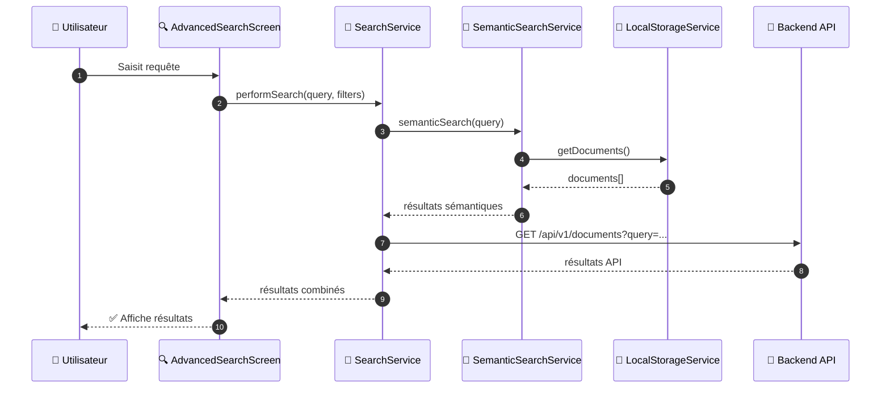
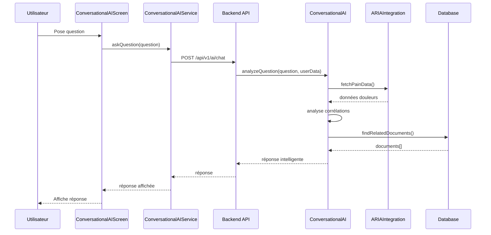
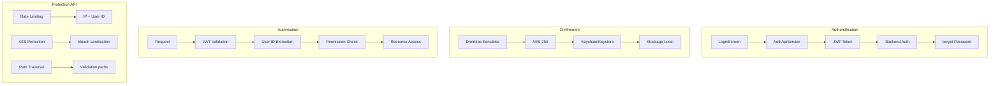
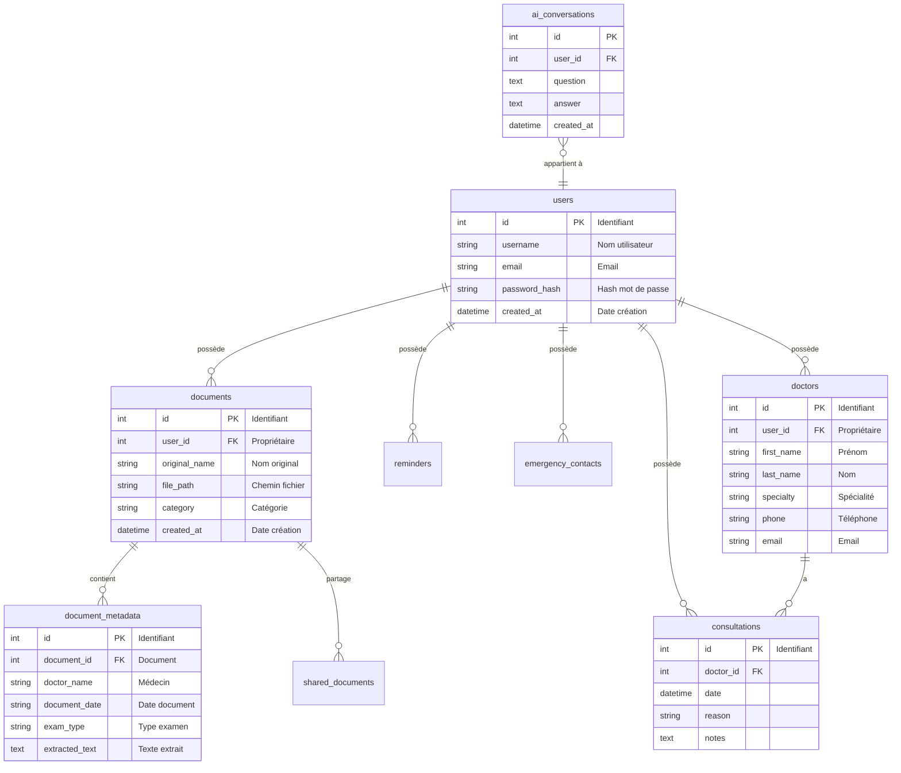
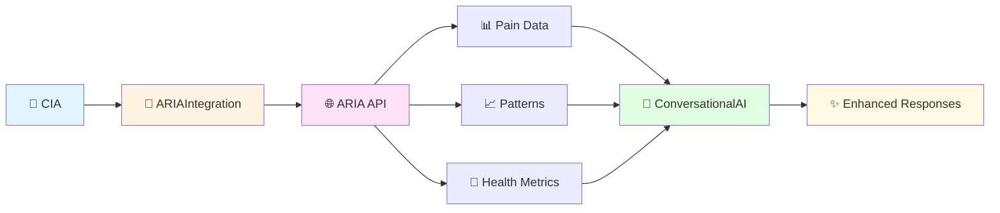
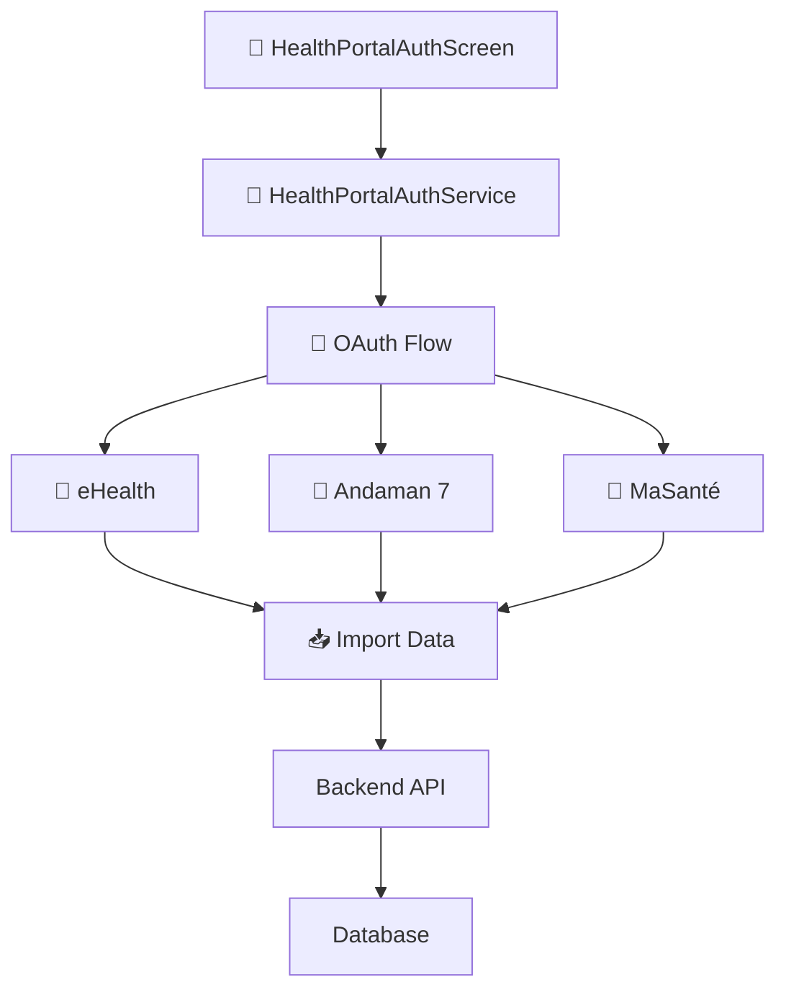
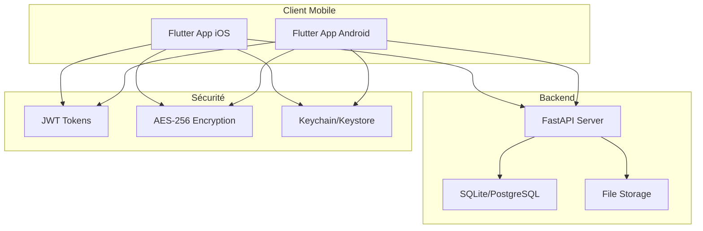

# 🏗️ Architecture — Arkalia CIA

<div align="center">

**Version** : 1.3.1+6 | **Dernière mise à jour** : 12 décembre 2025

[]()
[]()

</div>

Documentation technique de l'architecture système.

---

## Vue d'ensemble

Architecture **local-first** : simplicité, fiabilité, confidentialité.  
Fonctionne entièrement sur l'appareil, sans dépendances externes.

### Principes

1. **Local-First** : Données stockées localement
2. **Offline-First** : Fonctionnalités hors ligne
3. **Sécurité** : AES-256, JWT, biométrie
4. **Intégration native** : Calendrier, contacts
5. **Performance** : Cache, pagination, optimisations

---

## Architecture système



---

## Structure des composants

### Frontend Flutter

```
arkalia_cia/lib/
├── main.dart                    # Point d'entrée application
├── models/                      # Modèles de données
│   └── doctor.dart             # Modèle Doctor et Consultation
├── screens/                     # Écrans UI (25 écrans)
│   ├── home_page.dart          # Dashboard principal
│   ├── documents_screen.dart   # Gestion documents
│   ├── doctors_list_screen.dart # Liste médecins
│   ├── conversational_ai_screen.dart # Chat IA
│   ├── patterns_dashboard_screen.dart # Patterns IA
│   ├── family_sharing_screen.dart # Partage familial
│   ├── advanced_search_screen.dart # Recherche avancée
│   ├── onboarding/             # Onboarding intelligent
│   └── auth/                   # Authentification
│       ├── login_screen.dart
│       └── register_screen.dart
├── services/                    # Services métier (21 services)
│   ├── api_service.dart         # Communication backend
│   ├── local_storage_service.dart # Stockage local
│   ├── doctor_service.dart      # Gestion médecins
│   ├── search_service.dart      # Recherche
│   ├── conversational_ai_service.dart # IA conversationnelle
│   ├── family_sharing_service.dart # Partage familial
│   ├── auth_api_service.dart    # Authentification JWT
│   └── ...
└── utils/                       # Utilitaires
    ├── encryption_helper.dart   # Chiffrement AES-256
    ├── error_helper.dart        # Gestion erreurs
    └── validation_helper.dart   # Validation données
```

### Backend Python

```
arkalia_cia_python_backend/
├── api.py                       # FastAPI - 28 endpoints
├── aria_integration/api.py      # ARIA Integration - 8 endpoints
├── auth.py                      # Authentification JWT
├── database.py                  # Gestion base de données
├── pdf_processor.py             # Traitement PDF
├── security_utils.py            # Utilitaires sécurité
├── ai/                          # Modules IA
│   ├── conversational_ai.py     # IA conversationnelle
│   ├── pattern_analyzer.py      # Analyse patterns
│   └── aria_integration.py      # Intégration ARIA
├── pdf_parser/                  # Parsing PDF
│   ├── metadata_extractor.py    # Extraction métadonnées
│   ├── ocr_integration.py       # OCR Tesseract
│   └── ocr_processor.py         # Traitement OCR
└── aria_integration/            # Intégration ARIA
    └── api.py                   # API ARIA
```

---

## Flux de données

### Upload document



### Recherche avancée



### IA conversationnelle



---

## Architecture de sécurité



---

## Base de données

### Schéma principal



---

## Intégrations externes

### ARIA Integration



### Portails santé



---

## Performance et optimisation

### Cache intelligent

- **OfflineCacheService** : Cache des résultats de recherche (1h)
- **PatternsDashboardScreen** : Cache des patterns (6h)
- **SearchService** : Cache des résultats sémantiques

### Pagination

- Tous les endpoints GET supportent `skip` et `limit`
- Limite par défaut : 50, maximum : 100
- Réduction de la consommation mémoire de ~60%

### Optimisations mémoire

- Limitation données utilisateur envoyées à l'IA (10 docs, 5 médecins)
- Mémoire IA limitée à 50 éléments
- Extraction métadonnées PDF à la demande

---

## Déploiement

### Architecture de déploiement



---

## Tests

### Stratégie de tests

- **Tests unitaires** : 308 passed
- **Couverture** : 85% global
- **Tests Flutter** : Analyse statique (0 erreur)
- **Tests d'intégration** : Structure prête

---

## Roadmap future

### Court terme
- Import automatique portails santé (APIs externes)
- Recherche NLP avancée (modèles ML)

### Moyen terme
- Intégration robotique BBIA
- Modèles ML supplémentaires (LSTM)

### Long terme
- Application web complémentaire
- Export professionnel avancé

---

## Voir aussi

- **[API_DOCUMENTATION.md](./API_DOCUMENTATION.md)** — Documentation API complète
- **[VUE_ENSEMBLE_PROJET.md](./VUE_ENSEMBLE_PROJET.md)** — Vue d'ensemble visuelle
- **[DEPLOYMENT.md](./DEPLOYMENT.md)** — Guide de déploiement
- **[audits/CHECKLIST_FINALE_SECURITE.md](./audits/CHECKLIST_FINALE_SECURITE.md)** — Checklist sécurité
- **[INDEX_DOCUMENTATION.md](./INDEX_DOCUMENTATION.md)** — Index complet de la documentation

---

*Dernière mise à jour : 12 décembre 2025*
