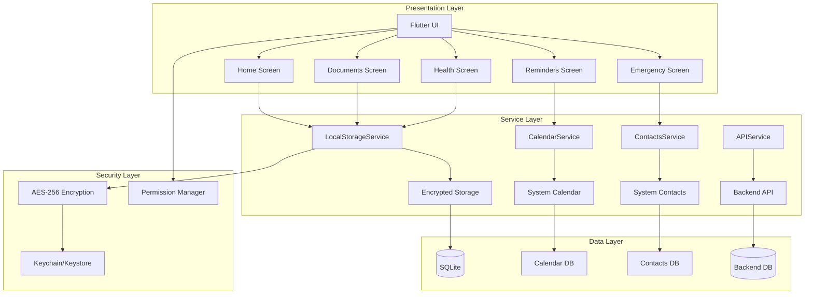
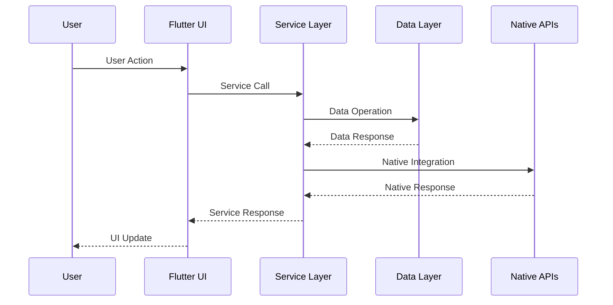
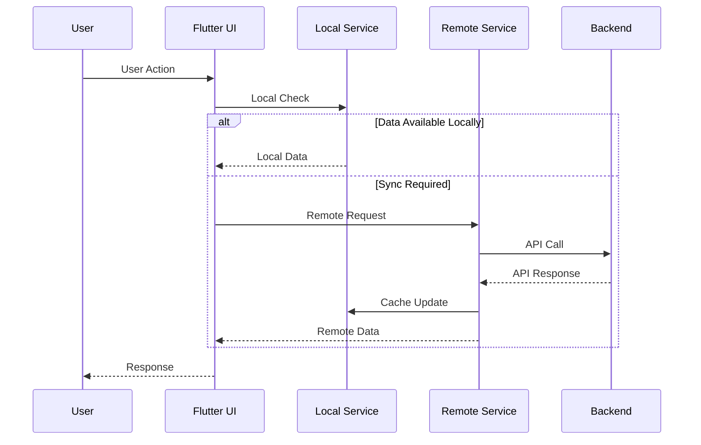
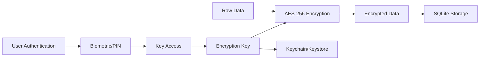
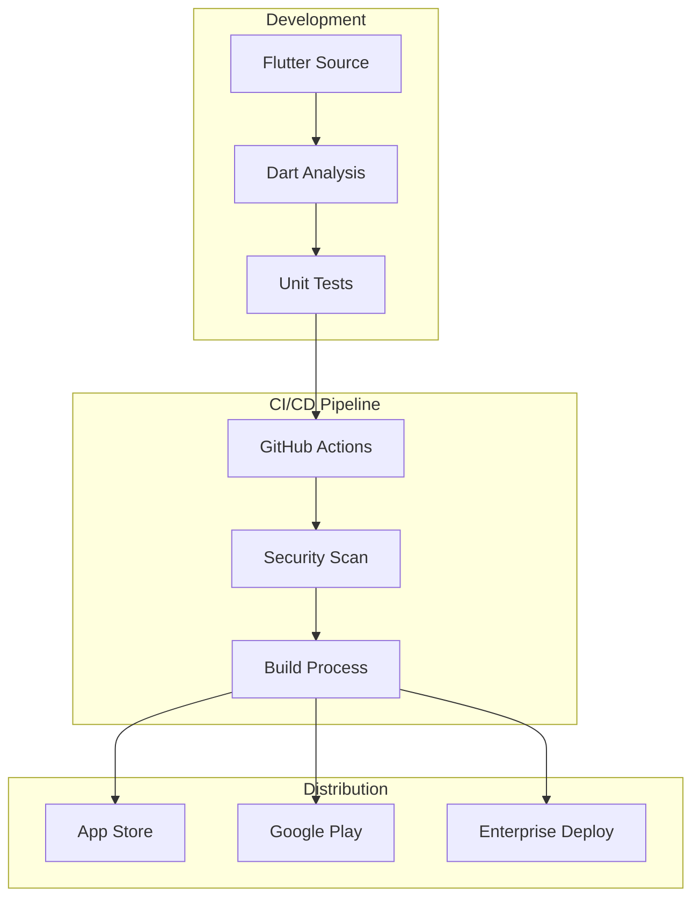
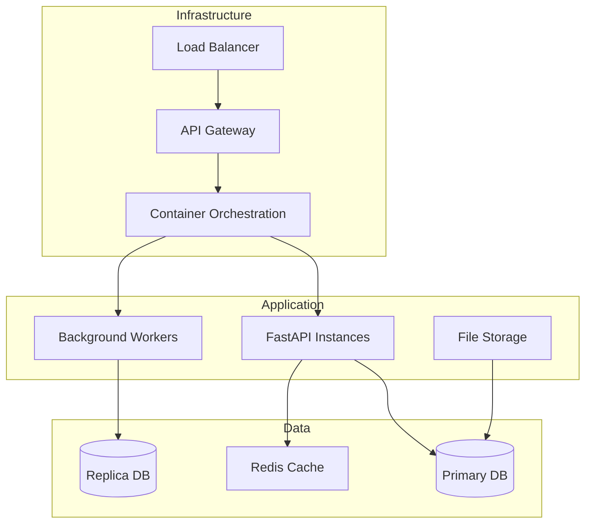
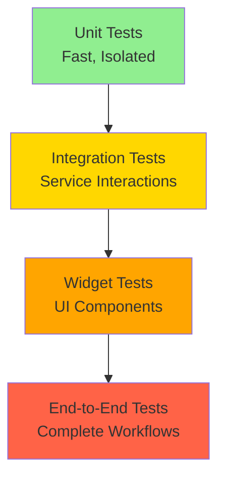
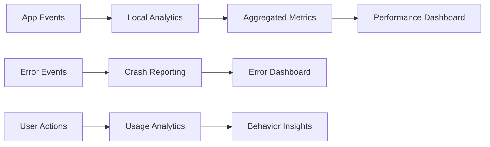

# Architecture

**Version** : 1.2.0  
**Dernière mise à jour** : 19 novembre 2025  
**Statut** : Production Ready

Documentation technique de l'architecture et de la conception système d'Arkalia CIA.

---

## Table des matières

1. [Overview](#overview)
2. [Architectural Principles](#architectural-principles)
3. [System Architecture](#system-architecture)
4. [Component Structure](#component-structure)
5. [Data Flow Patterns](#data-flow-patterns)
6. [Service Specifications](#service-specifications)
7. [Security Architecture](#security-architecture)
8. [Performance Considerations](#performance-considerations)
9. [Deployment Architecture](#deployment-architecture)
10. [Testing Strategy](#testing-strategy)
11. [Future Roadmap](#future-roadmap)
12. [Monitoring and Observability](#monitoring-and-observability)

---

## Overview

Arkalia CIA implements a **local-first architecture** prioritizing simplicity, reliability, and data privacy. The application operates entirely on-device without external dependencies for core functionality.

## Architectural Principles

### 1. Local-First Design

| Principle | Implementation | Benefit |
|-----------|---------------|---------|
| **Local Storage** | All data stored locally on device | Zero network dependency |
| **Offline-First** | Core operations work offline | Maximum reliability |
| **Optional Sync** | Synchronization in Phase 3 | Progressive enhancement |
| **Data Privacy** | No cloud dependency required | Complete user control |

### 2. Native Integration

| Integration | Platform | Purpose |
|------------|----------|---------|
| **System Calendar** | iOS/Android | Reminder functionality |
| **System Contacts** | iOS/Android | Emergency contacts |
| **Biometric Auth** | iOS/Android | Secure access |
| **Notifications** | iOS/Android | Reminder alerts |

### 3. Security by Design

| Security Layer | Implementation | Status |
|----------------|---------------|--------|
| **Encryption** | AES-256 for sensitive data | ✅ Active |
| **Key Management** | Keychain/Keystore | ✅ Active |
| **Permissions** | Minimal requirements | ✅ Configured |
| **Data Storage** | No plaintext storage | ✅ Enforced |

## System Architecture



## Component Structure

### Frontend (Flutter)

```
lib/
├── main.dart                     # Application entry point
├── screens/                      # UI screens
│   ├── home_page.dart            # Main dashboard
│   ├── documents_screen.dart     # Document management
│   ├── health_screen.dart        # Health portals
│   ├── reminders_screen.dart     # Calendar integration
│   └── emergency_screen.dart     # Emergency contacts
└── services/                     # Business logic
    ├── api_service.dart          # Backend communication
    ├── calendar_service.dart     # Calendar integration
    ├── contacts_service.dart     # Contacts management
    └── local_storage_service.dart # Local data persistence
```

### Backend (Python)

```
arkalia_cia_python_backend/
├── api.py                        # FastAPI endpoints
├── auto_documenter.py            # Documentation generator
├── database.py                   # Database operations
├── pdf_processor.py              # PDF handling
├── security_dashboard.py         # Security monitoring
└── storage.py                    # File management
```

## Data Flow Patterns

### Phase 1: Local Operations



### Phase 3: Hybrid Operations



## Service Specifications

### LocalStorageService

**Purpose**: Secure local data persistence

**Key Features**:
- AES-256 encryption for sensitive data
- SQLite database operations
- Document metadata management
- User preference storage

**Methods**:
```dart
Future<void> saveDocument(Document doc);
Future<List<Document>> getDocuments();
Future<void> saveReminder(Reminder reminder);
Future<List<Reminder>> getReminders();
```

### CalendarService

**Purpose**: System calendar integration

**Key Features**:
- Native calendar API integration
- Event creation and management
- Notification scheduling
- Timezone handling

**Methods**:
```dart
Future<void> createEvent(CalendarEvent event);
Future<List<CalendarEvent>> getEvents();
Future<void> scheduleNotification(Reminder reminder);
```

### ContactsService

**Purpose**: System contacts integration

**Key Features**:
- Native contacts API access
- Emergency contact management
- Direct calling functionality
- Contact synchronization

**Methods**:
```dart
Future<List<Contact>> getContacts();
Future<void> addContact(Contact contact);
Future<bool> makeCall(String phoneNumber);
```

### APIService

**Purpose**: Backend communication (Phase 3)

**Key Features**:
- FastAPI endpoint communication
- Document upload/download
- Synchronization management
- Error handling and retry logic

## Security Architecture

### Encryption Strategy



### Permission Model

| Permission | Purpose | Justification | Platform |
|------------|---------|---------------|----------|
| **Calendar** | Read/Write events | Reminder functionality | iOS/Android |
| **Contacts** | Read contact info | Emergency contacts | iOS/Android |
| **Storage** | App-specific files | Document storage | iOS/Android |
| **Notifications** | Alert delivery | Reminder notifications | iOS/Android |
| **Biometric** | Device authentication | Secure access | iOS/Android |

### Data Classification

| Data Type | Sensitivity | Encryption | Storage | Sync |
|-----------|-------------|------------|---------|------|
| **Documents** | High | AES-256 | Local only | Optional |
| **Health Info** | High | AES-256 | Local only | Optional |
| **Reminders** | Medium | Metadata only | Calendar sync | System |
| **Contacts** | Medium | Reference only | System contacts | System |
| **Preferences** | Low | None | Local storage | No |

## Performance Considerations

### Optimization Strategies

1. **Lazy Loading**: Load data on-demand
2. **Local Caching**: Cache frequently accessed data
3. **Document Compression**: Compress large files
4. **Background Processing**: Handle heavy operations asynchronously

### Performance Metrics

| Operation | Target Response Time | Max File Size |
|-----------|---------------------|---------------|
| Document Load | < 500ms | 10MB |
| Search Query | < 200ms | N/A |
| Calendar Sync | < 1s | N/A |
| Contact Access | < 100ms | N/A |

## Deployment Architecture

### Mobile Deployment



### Backend Deployment (Phase 3)



## Testing Strategy

### Test Pyramid



### Coverage Targets

| Test Type | Coverage Target | Current Status | Codecov Flag | Status |
|-----------|----------------|----------------|--------------|--------|
| **Unit Tests** | 80% | 85% | `python` | ✅ Exceeded |
| **Integration** | 70% | 85% | `python` | ✅ Exceeded |
| **Widget Tests** | 60% | 45% | `flutter` | 🟡 In Progress |
| **E2E Tests** | 50% | 30% | `flutter` | 🟡 In Progress |

#### Codecov Integration

Le projet utilise **Codecov** pour le suivi continu de la couverture :
- **Configuration**: `.codecov.yml` avec flags séparés pour Python et Flutter
- **CI/CD**: Upload automatique des rapports de couverture
- **Dashboard**: Suivi en temps réel sur [codecov.io](https://codecov.io)
- **Seuils**: 70% pour le projet global, 60% pour les patches

## Future Roadmap

### Phase 1: Local MVP ✅
- Core Flutter application
- Local storage implementation
- Native service integration
- Basic security measures

### Phase 2: Enhanced Features ✅
- Advanced calendar integration
- Improved contact management
- Enhanced UI/UX
- Comprehensive testing

### Phase 3: Connected Ecosystem 🔄
- Backend API development
- Cloud synchronization
- Multi-device support
- Advanced security features

### Phase 4: Intelligence Layer 📋
- AI-powered suggestions
- Predictive reminders
- Voice integration
- Advanced analytics

## Monitoring and Observability

### Metrics Collection



### Key Performance Indicators

- **Reliability**: 99.9% uptime target
- **Performance**: <500ms average response time
- **Security**: Zero data breaches
- **User Experience**: <3 taps for core actions

---

## 📚 Related Documentation

- **[API.md](API.md)** - Complete API reference
- **[DEPLOYMENT.md](DEPLOYMENT.md)** - Deployment procedures
- **[SECURITY.md](../SECURITY.md)** - Security policies
- **[INDEX_DOCUMENTATION.md](INDEX_DOCUMENTATION.md)** - Full documentation index

---

**Last Updated**: November 19, 2025  
*This architecture documentation is maintained alongside code changes and reviewed quarterly for accuracy and relevance.*
