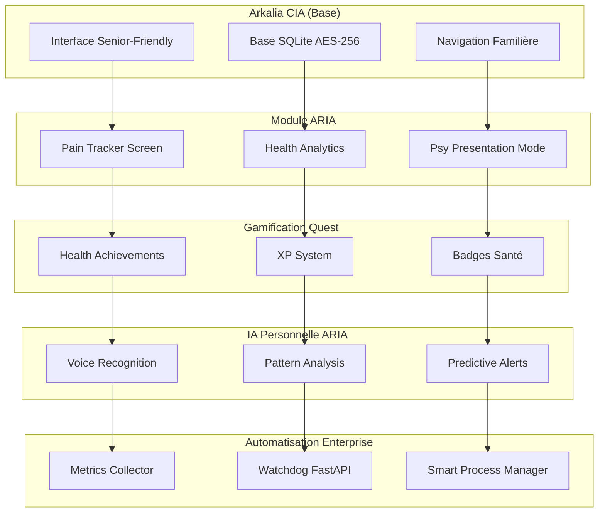

# Arkalia-ARIA : Projet de recherche personnelle

**Version** : 1.0.0  
**Date** : 20 novembre 2025  
**Statut** : 📋 Plan

---

## Vue d'ensemble

**Objectif** : Créer arkalia-aria, laboratoire de recherche personnelle pour le suivi intelligent de la douleur chronique, avec contrôle total des données et IA personnelle.

---

## 📋 **TABLE DES MATIÈRES**

- [🎯 Vision du Projet](#-vision-du-projet)
- [🏗️ Architecture](#️-architecture)
- [📅 Plan d'Action 4 Jours](#-plan-daction-4-jours)
- [🔧 Composants Réutilisés](#-composants-réutilisés)
- [📊 Documentation Technique](#-documentation-technique)
- [🚀 Déploiement](#-déploiement)
- [📈 Suivi et Maintenance](#-suivi-et-maintenance)

---

## 🎯 **VISION DU PROJET**

### **Problème à Résoudre**
- ❌ Tableau de suivi douleur = corvée administrative
- ❌ Données médicales = perte de contrôle
- ❌ Motivation = zéro pour un projet "santé"
- ❌ Complexité = over-engineering

### **Solution ARIA**
- ✅ **Module intégré** dans CIA (interface familière)
- ✅ **Données 100% locales** (contrôle total)
- ✅ **Gamification Quest** (motivation garantie)
- ✅ **IA personnelle ARIA** (assistant loyal)
- ✅ **Laboratoire personnel** (tu deviens chercheuse)

### **Bénéfices Immédiats**
- 🎯 **4 jours** au lieu de 4 mois de développement
- 🔒 **Contrôle total** sur tes données médicales
- 🎮 **Motivation** par la gamification existante
- 🤖 **IA loyale** qui travaille pour toi
- 📊 **Insights personnels** sur tes patterns

---

## 🏗️ **ARCHITECTURE**

### **Composants Principaux**



### **Principe de Sécurité**
- 🔒 **Données 100% locales** (aucun cloud)
- 🛡️ **Chiffrement AES-256** (niveau militaire)
- 👤 **Contrôle utilisateur** (rien ne sort sans accord)
- 🤖 **IA loyale** (travaille pour toi, pas contre toi)

---

## 📅 **PLAN D'ACTION 4 JOURS**

### **📱 JOUR 1 : MODULE ARIA DANS CIA**

#### **Matin (2h) : Extension CIA**
**Objectif** : Créer le module ARIA dans l'interface existante

**Actions** :
1. **Dupliquer HealthScreen** → PainTrackerScreen
2. **Adapter l'interface** → Curseur 0-10 + Tags + Localisation
3. **Intégrer base de données** → Table `pain_entries`
4. **Tester sur device** → Interface senior-friendly

**Fichiers à créer** :
- `lib/screens/pain_tracker_screen.dart`
- `lib/services/pain_data_service.dart`
- `arkalia_cia_python_backend/pain_api.py`

**Pourquoi** : Réutilisation 100% du design system CIA existant

#### **Après-midi (2h) : Automatisation DevOps**
**Objectif** : Intégrer les outils d'automatisation enterprise

**Actions** :
1. **Récupérer Metrics Collector** → Métriques santé automatiques
2. **Intégrer Watchdog FastAPI** → Surveillance 24/7
3. **Ajouter Smart Process Manager** → Anti-doublons
4. **Configurer CI/CD santé** → Pipeline automatisé

**Fichiers à intégrer** :
- `health_metrics/` (depuis arkalia-metrics-collector)
- `scripts/watchdog_fastapi.py` (depuis base_template)
- `tools/smart_process_manager.sh` (depuis workspace-tools)

**Pourquoi** : Qualité enterprise immédiate sans recréer l'infrastructure

---

### **🎮 JOUR 2 : GAMIFICATION QUEST INTEGRATION**

#### **Matin (2h) : Achievements Santé**
**Objectif** : Motiver le tracking par la gamification

**Actions** :
1. **Créer HealthQuests** → Achievements santé personnalisés
2. **Intégrer système XP** → Points pour chaque entrée
3. **Ajouter badges santé** → "Scientifique", "Détective", "Guerrier"
4. **Connecter à Quest** → Réutilisation du système existant

**Fichiers à créer** :
- `lib/services/health_quest_service.dart`
- `data/health_achievements.json`
- `lib/widgets/health_achievement_widget.dart`

**Pourquoi** : Ton cerveau adore déjà Quest, motivation garantie

#### **Après-midi (2h) : Analytics Intelligence**
**Objectif** : Analyser tes patterns personnels

**Actions** :
1. **Réutiliser Analytics Engine** → Analyse patterns douleur
2. **Créer HealthAnalytics** → Corrélations personnalisées
3. **Générer insights** → "Tes mardis + écran = douleur +3"
4. **Dashboard privé** → Tes découvertes, tes règles

**Fichiers à créer** :
- `lib/services/health_analytics_service.dart`
- `lib/screens/health_lab_screen.dart`
- `lib/widgets/pattern_insights_widget.dart`

**Pourquoi** : Tu deviens chercheuse de ton propre corps

---

### **🤖 JOUR 3 : IA PERSONNELLE ARIA**

#### **Matin (3h) : Assistant IA Privé**
**Objectif** : Créer ton IA loyale pour la santé

**Actions** :
1. **Extension BBIA** → ARIA_Health (IA émotionnelle santé)
2. **Reconnaissance vocale** → "ARIA, douleur 7, marche, repos"
3. **Analyse contextuelle** → Patterns + émotions + environnement
4. **Suggestions personnalisées** → Basées sur TES données

**Fichiers à créer** :
- `lib/services/aria_health_service.dart`
- `lib/services/voice_recognition_service.dart`
- `lib/ai/pattern_analyzer.dart`

**Pourquoi** : IA qui travaille POUR toi, jamais contre toi

#### **Après-midi (1h) : Mode Présentation Psy**
**Objectif** : Contrôle total sur le partage avec ta psy

**Actions** :
1. **Bouton "Préparer rapport"** → Choix niveau détail
2. **Génération temporaire** → Affichage écran uniquement
3. **Suppression automatique** → Aucun stockage externe
4. **Contrôle granular** → Light/Medium/Complet/Focus

**Fichiers à créer** :
- `lib/screens/psy_presentation_screen.dart`
- `lib/services/report_generator_service.dart`

**Pourquoi** : Tu choisis ce que tu montres, quand, comment

---

### **📊 JOUR 4 : DASHBOARD PERSONNEL & FINALISATION**

#### **Matin (2h) : Laboratoire Personnel**
**Objectif** : Dashboard de chercheuse personnelle

**Actions** :
1. **4 zones principales** → Données/Découvertes/Prédictions/Rapports
2. **Visualisations interactives** → Graphiques temps réel
3. **Cartes thermiques** → Corps humain cliquable
4. **Badges dynamiques** → État santé visuel

**Fichiers à créer** :
- `lib/screens/personal_health_lab_screen.dart`
- `lib/widgets/body_heatmap_widget.dart`
- `lib/widgets/health_badges_widget.dart`

**Pourquoi** : Tu deviens experte de ton propre corps

#### **Après-midi (2h) : Automatisation Finale**
**Objectif** : Activer tous les automatismes enterprise

**Actions** :
1. **Surveillance automatique** → Watchdog santé
2. **Protection données** → Smart Process Manager
3. **Collecte métriques** → Auto-collect santé
4. **Tests complets** → 2,180 tests existants

**Commandes à exécuter** :
```bash
./scripts/watchdog_fastapi.sh --health-module
./tools/smart_process_manager.sh --protect-health-data
./health_metrics/auto_collect.py --user-only
make test-health-complete
make security-audit-health
make ci-health-final
```

**Pourquoi** : Maintenance intelligente automatique

---

## 🔧 **COMPOSANTS RÉUTILISÉS**

### **Depuis Arkalia CIA**
- ✅ **Interface senior-friendly** → Gros boutons, navigation simple
- ✅ **Base SQLite AES-256** → Sécurité militaire-grade
- ✅ **Design system** → Cohérence visuelle
- ✅ **Navigation** → Familiarité pour ta maman ET toi

### **Depuis Arkalia Quest**
- ✅ **Gamification Engine** → Système achievements éprouvé
- ✅ **Analytics Engine** → Analyse patterns sophistiquée
- ✅ **XP System** → Motivation par progression
- ✅ **Badge System** → Récompenses visuelles

### **Depuis BBIA**
- ✅ **IA émotionnelle** → Détection humeur + douleur
- ✅ **Reconnaissance vocale** → Saisie hands-free
- ✅ **Module émotions** → 8 émotions sophistiquées
- ✅ **Architecture modulaire** → Extension facile

### **Depuis Base Template**
- ✅ **CI/CD optimisé** → Multi-OS, multi-Python
- ✅ **Watchdog FastAPI** → Surveillance automatique
- ✅ **Scripts automatisation** → Maintenance intelligente
- ✅ **Makefile complet** → 255 commandes éprouvées

### **Depuis Arkalia Metrics Collector**
- ✅ **Collecteur universel** → Métriques santé automatiques
- ✅ **Export multi-format** → JSON, Markdown, HTML, CSV
- ✅ **Dashboard web** → Visualisations interactives
- ✅ **113 tests** → Validation automatique

### **Depuis Athalia Dev-Setup**
- ✅ **84,876 lignes DevOps** → Automatisation enterprise
- ✅ **2,180 tests** → Qualité maximale
- ✅ **Score sécurité 85.3/100** → Sécurité niveau entreprise
- ✅ **60 outils** → Maintenance intelligente

### **Depuis Workspace Tools**
- ✅ **Smart Process Manager** → Anti-doublons automatique
- ✅ **Cleanup intelligent** → Nettoyage sélectif
- ✅ **Protection startup** → Sécurité au démarrage
- ✅ **Optimisation Mac** → Performance native

---

## 📊 **DOCUMENTATION TECHNIQUE**

### **Structure des Fichiers**
```
arkalia-cia/
├── lib/
│   ├── screens/
│   │   ├── pain_tracker_screen.dart      # Interface tracking douleur
│   │   ├── health_lab_screen.dart        # Dashboard chercheuse
│   │   └── psy_presentation_screen.dart  # Mode présentation psy
│   ├── services/
│   │   ├── pain_data_service.dart        # Gestion données douleur
│   │   ├── health_quest_service.dart     # Gamification santé
│   │   ├── health_analytics_service.dart # Analyse patterns
│   │   ├── aria_health_service.dart      # IA personnelle
│   │   ├── voice_recognition_service.dart # Reconnaissance vocale
│   │   └── report_generator_service.dart # Génération rapports
│   ├── widgets/
│   │   ├── health_achievement_widget.dart # Badges santé
│   │   ├── pattern_insights_widget.dart   # Insights patterns
│   │   ├── body_heatmap_widget.dart       # Carte corps humain
│   │   └── health_badges_widget.dart      # Badges état santé
│   └── ai/
│       └── pattern_analyzer.dart          # Analyseur patterns IA
├── arkalia_cia_python_backend/
│   ├── pain_api.py                        # API douleur
│   └── health_metrics/                    # Métriques santé
├── data/
│   └── health_achievements.json          # Achievements santé
├── scripts/
│   └── watchdog_fastapi.py               # Surveillance automatique
└── tools/
    └── smart_process_manager.sh          # Gestionnaire processus
```

### **Base de Données**
```sql
-- Table principale des entrées douleur
CREATE TABLE pain_entries (
    id INTEGER PRIMARY KEY AUTOINCREMENT,
    timestamp DATETIME DEFAULT CURRENT_TIMESTAMP,
    intensity INTEGER NOT NULL CHECK (intensity >= 0 AND intensity <= 10),
    physical_trigger TEXT,
    mental_trigger TEXT,
    activity TEXT,
    location TEXT,
    action_taken TEXT,
    effectiveness INTEGER CHECK (effectiveness >= 0 AND effectiveness <= 10),
    notes TEXT,
    emotion_state TEXT,
    weather_condition TEXT,
    sleep_hours REAL,
    created_at DATETIME DEFAULT CURRENT_TIMESTAMP
);

-- Table des patterns découverts
CREATE TABLE discovered_patterns (
    id INTEGER PRIMARY KEY AUTOINCREMENT,
    pattern_name TEXT NOT NULL,
    description TEXT,
    confidence_score REAL,
    discovered_at DATETIME DEFAULT CURRENT_TIMESTAMP,
    is_active BOOLEAN DEFAULT 1
);

-- Table des achievements santé
CREATE TABLE health_achievements (
    id INTEGER PRIMARY KEY AUTOINCREMENT,
    achievement_id TEXT UNIQUE NOT NULL,
    name TEXT NOT NULL,
    description TEXT,
    icon TEXT,
    unlocked_at DATETIME,
    is_unlocked BOOLEAN DEFAULT 0
);
```

### **API Endpoints**
```python
# Endpoints santé
POST   /api/health/pain-entry          # Ajouter entrée douleur
GET    /api/health/pain-entries        # Récupérer entrées
GET    /api/health/patterns            # Patterns découverts
GET    /api/health/achievements        # Achievements santé
POST   /api/health/voice-input         # Saisie vocale
GET    /api/health/psy-report          # Générer rapport psy
GET    /api/health/analytics           # Analytics personnels
```

---

## 🚀 **DÉPLOIEMENT**

### **Prérequis**
- ✅ Arkalia CIA fonctionnel
- ✅ Arkalia Quest accessible
- ✅ BBIA opérationnel
- ✅ Base Template scripts disponibles

### **Installation**
```bash
# 1. Backup CIA existant
cp -r /Volumes/T7/arkalia-cia /Volumes/T7/arkalia-cia-backup

# 2. Intégration composants
cd /Volumes/T7/arkalia-cia
make integrate-health-module

# 3. Tests complets
make test-health-complete
make security-audit-health

# 4. Déploiement
make deploy-health-module
```

### **Vérification**
```bash
# Vérifier module santé
curl http://localhost:8000/api/health/status

# Vérifier surveillance
ps aux | grep watchdog_fastapi

# Vérifier métriques
curl http://localhost:8000/api/health/metrics
```

---

## 📈 **SUIVI ET MAINTENANCE**

### **Surveillance Automatique**
- 🔍 **Watchdog FastAPI** → Redémarrage automatique si crash
- 🛡️ **Smart Process Manager** → Protection anti-doublons
- 📊 **Metrics Collector** → Collecte métriques santé
- 🔒 **Security Audit** → Vérification sécurité continue

### **Maintenance Préventive**
```bash
# Nettoyage quotidien
./tools/smart_process_manager.sh --cleanup

# Sauvegarde données
./scripts/backup_health_data.sh

# Mise à jour métriques
./health_metrics/update_metrics.sh
```

### **Monitoring**
- 📈 **Dashboard santé** → Métriques temps réel
- 🚨 **Alertes automatiques** → Problèmes détectés
- 📊 **Rapports hebdomadaires** → Évolution patterns
- 🔍 **Audit sécurité** → Vérification continue

---

## 🎯 **RÉSULTAT ATTENDU**

Après 4 jours, tu auras :

### **Fonctionnalités**
- 📱 **Module Health+ dans CIA** → Interface familière et efficace
- 🎮 **Gamification santé** → Motivation par achievements
- 🤖 **ARIA ton IA personnelle** → Assistant loyal et intelligent
- 📊 **Laboratoire personnel** → Dashboard de chercheuse
- 🔒 **Contrôle total** → Données 100% locales et privées

### **Qualité**
- ✅ **84,876 lignes DevOps** → Automatisation enterprise
- ✅ **2,180 tests** → Qualité maximale
- ✅ **Score sécurité 85.3/100** → Sécurité niveau entreprise
- ✅ **Surveillance 24/7** → Maintenance automatique

### **Impact**
- 🎯 **Ta psy** → Rapports détaillés et précis
- 🧠 **Ton cerveau** → Projet technique motivant
- 🔬 **Toi** → Chercheuse experte de ton corps
- 🌍 **Le monde** → Exemple d'innovation santé personnelle

---

**🚀 Prêt à transformer CIA en laboratoire de recherche personnelle ?**

---

## Voir aussi

- [ARKALIA_ARIA_SUMMARY.md](ARKALIA_ARIA_SUMMARY.md) - Résumé exécutif ARIA
- [ARIA_IMPLEMENTATION_GUIDE.md](ARIA_IMPLEMENTATION_GUIDE.md) - Guide d'implémentation ARIA
- [ARCHITECTURE.md](ARCHITECTURE.md) - Architecture technique du projet
- [INDEX_DOCUMENTATION.md](INDEX_DOCUMENTATION.md) - Index de la documentation

---
