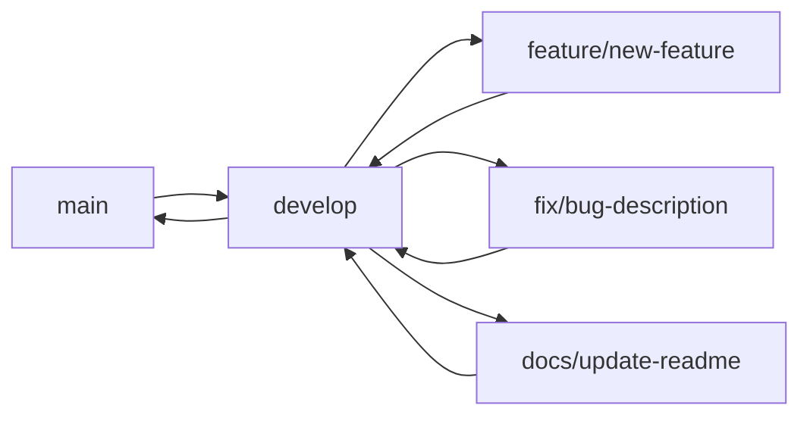

# Guide de contribution

**Version** : 1.3.1  
**Dernière mise à jour** : 27 novembre 2025

Guide des contributions et standards de développement pour Arkalia CIA.

---

## Table des matières

1. [Welcome Contributors](#welcome-contributors)
2. [Code of Conduct](#code-of-conduct)
3. [Getting Started](#getting-started)
4. [Development Workflow](#development-workflow)
5. [Code Standards](#code-standards)
6. [Testing Requirements](#testing-requirements)
7. [Documentation](#documentation)
8. [Pull Request Process](#pull-request-process)

---

## Welcome Contributors

Arkalia CIA is an open-source project that welcomes community contributions. This guide outlines how to contribute effectively to the project while maintaining our quality standards.

## Code of Conduct

### Core Principles

- **Respect**: Treat all contributors with respect and dignity
- **Inclusion**: Welcome contributions from everyone regardless of background
- **Collaboration**: Work together to improve the project for all users
- **Excellence**: Maintain high standards in code quality and documentation

### Expected Behavior

✅ **Do**:
- Use respectful and inclusive language
- Provide constructive feedback
- Accept criticism gracefully
- Respect project maintainer decisions
- Help others learn and grow

❌ **Don't**:
- Use discriminatory or offensive language
- Make personal attacks
- Spam or self-promote
- Share inappropriate content

## Getting Started

### Prerequisites

| Tool | Version | Purpose | Download |
|------|---------|---------|----------|
| **Flutter SDK** | 3.35.3+ | Mobile app development | [flutter.dev](https://flutter.dev) |
| **Dart SDK** | >=3.0.0 <4.0.0 | Language runtime | Included with Flutter |
| **Python** | 3.10+ | Backend services | [python.org](https://python.org) |
| **Git** | Latest | Version control | [git-scm.com](https://git-scm.com) |

### Development Setup

**1. Fork and Clone**
```bash
# Fork the repository on GitHub
# Then clone your fork
git clone https://github.com/YOUR_USERNAME/arkalia-cia.git
cd arkalia-cia

# Add upstream remote
git remote add upstream https://github.com/arkalia-luna-system/arkalia-cia.git
```

**2. Environment Setup**
```bash
# Install development dependencies
make install-dev

# Setup pre-commit hooks
pre-commit install

# Verify setup
make check
```

**3. Verify Installation**
```bash
# Run tests
make test

# Check linting
make lint

# Format code
make format
```

## Development Workflow

### Branch Strategy



**Branch Naming Convention**:
```bash
# Feature branches
feature/user-authentication
feature/document-upload

# Bug fixes
fix/calendar-sync-error
fix/login-validation

# Documentation
docs/api-reference
docs/setup-guide

# Chores
chore/update-dependencies
chore/refactor-services
```

### Commit Message Standards

Follow [Conventional Commits](https://www.conventionalcommits.org/):

```bash
# Format
type(scope): description

# Examples
feat(auth): add biometric authentication
fix(calendar): resolve sync timeout issue
docs(api): update endpoint documentation
test(storage): add encryption test cases
chore(deps): update Flutter to 3.35.3

# Types
feat     # New feature
fix      # Bug fix
docs     # Documentation
style    # Code style changes
refactor # Code refactoring
test     # Adding tests
chore    # Maintenance tasks
```

## Code Standards

### Flutter/Dart Standards

**File Structure**:
```dart
// lib/services/document_service.dart
import 'package:flutter/foundation.dart';
import 'package:flutter/material.dart';

import '../models/document.dart';
import '../utils/encryption.dart';

/// Service for managing document operations.
class DocumentService {
  static const String _storageKey = 'documents';

  /// Saves a document securely to local storage.
  ///
  /// Throws [StorageException] if save operation fails.
  static Future<void> saveDocument(Document document) async {
    try {
      // Implementation
    } on StorageException catch (e) {
      debugPrint('Failed to save document: $e');
      rethrow;
    }
  }

  // Private methods use underscore prefix
  static Future<String> _encryptDocument(Document doc) async {
    // Implementation
  }
}
```

**Widget Standards**:
```dart
class DocumentTile extends StatelessWidget {
  const DocumentTile({
    super.key,
    required this.document,
    this.onTap,
  });

  final Document document;
  final VoidCallback? onTap;

  @override
  Widget build(BuildContext context) {
    return Card(
      child: ListTile(
        title: Text(document.name),
        subtitle: Text(_formatFileSize(document.size)),
        onTap: onTap,
      ),
    );
  }

  String _formatFileSize(int bytes) {
    // Implementation
  }
}
```

### Python Standards

**Service Classes**:
```python
from typing import List, Optional
from pydantic import BaseModel

class DocumentService:
    """Service for document management operations."""

    def __init__(self, storage_path: str) -> None:
        """Initialize document service.

        Args:
            storage_path: Path to document storage directory
        """
        self._storage_path = storage_path

    async def save_document(
        self,
        content: bytes,
        filename: str
    ) -> Document:
        """Save document to secure storage.

        Args:
            content: Document binary content
            filename: Original filename

        Returns:
            Saved document metadata

        Raises:
            StorageError: If save operation fails
        """
        try:
            # Implementation
            pass
        except Exception as e:
            logger.error(f"Failed to save document: {e}")
            raise StorageError(f"Save failed: {e}") from e
```

**API Endpoints**:
```python
from fastapi import APIRouter, HTTPException, status
from pydantic import BaseModel

router = APIRouter(prefix="/api/documents", tags=["documents"])

class DocumentResponse(BaseModel):
    """Document response model."""
    id: int
    name: str
    size: int
    created_at: str

@router.post("/", response_model=DocumentResponse)
async def create_document(
    file: UploadFile = File(...),
    service: DocumentService = Depends(get_document_service)
) -> DocumentResponse:
    """Upload and save a new document."""
    try:
        document = await service.save_document(
            content=await file.read(),
            filename=file.filename
        )
        return DocumentResponse.from_document(document)
    except StorageError as e:
        raise HTTPException(
            status_code=status.HTTP_500_INTERNAL_SERVER_ERROR,
            detail=str(e)
        )
```

## Testing Guidelines

### Test Structure

```
tests/
├── unit/                    # Unit tests
│   ├── test_services.py
│   └── test_models.py
├── integration/             # Integration tests
│   ├── test_api.py
│   └── test_database.py
└── fixtures/               # Test data
    ├── documents/
    └── test_data.json
```

### Flutter Tests

**Unit Tests**:
```dart
// test/services/document_service_test.dart
import 'package:flutter_test/flutter_test.dart';
import 'package:mockito/mockito.dart';

import 'package:arkalia_cia/services/document_service.dart';
import '../mocks/mocks.dart';

void main() {
  group('DocumentService', () {
    late MockLocalStorage mockStorage;

    setUp(() {
      mockStorage = MockLocalStorage();
    });

    test('should save document successfully', () async {
      // Arrange
      final document = Document(name: 'test.pdf', size: 1024);
      when(mockStorage.save(any)).thenAnswer((_) async => true);

      // Act
      await DocumentService.saveDocument(document);

      // Assert
      verify(mockStorage.save(any)).called(1);
    });

    test('should throw StorageException on save failure', () async {
      // Arrange
      final document = Document(name: 'test.pdf', size: 1024);
      when(mockStorage.save(any)).thenThrow(Exception('Storage full'));

      // Act & Assert
      expect(
        () => DocumentService.saveDocument(document),
        throwsA(isA<StorageException>()),
      );
    });
  });
}
```

**Widget Tests**:
```dart
// test/widgets/document_tile_test.dart
import 'package:flutter/material.dart';
import 'package:flutter_test/flutter_test.dart';

import 'package:arkalia_cia/widgets/document_tile.dart';
import 'package:arkalia_cia/models/document.dart';

void main() {
  group('DocumentTile', () {
    testWidgets('should display document information', (tester) async {
      // Arrange
      final document = Document(
        name: 'Medical Report.pdf',
        size: 2048000,
      );

      // Act
      await tester.pumpWidget(
        MaterialApp(
          home: Scaffold(
            body: DocumentTile(document: document),
          ),
        ),
      );

      // Assert
      expect(find.text('Medical Report.pdf'), findsOneWidget);
      expect(find.text('2.0 MB'), findsOneWidget);
    });

    testWidgets('should call onTap when tapped', (tester) async {
      // Arrange
      bool tapped = false;
      final document = Document(name: 'test.pdf', size: 1024);

      // Act
      await tester.pumpWidget(
        MaterialApp(
          home: Scaffold(
            body: DocumentTile(
              document: document,
              onTap: () => tapped = true,
            ),
          ),
        ),
      );

      await tester.tap(find.byType(DocumentTile));

      // Assert
      expect(tapped, isTrue);
    });
  });
}
```

### Python Tests

**Unit Tests**:
```python
# tests/unit/test_document_service.py
import pytest
from unittest.mock import AsyncMock, patch

from arkalia_cia_python_backend.services import DocumentService
from arkalia_cia_python_backend.models import Document
from arkalia_cia_python_backend.exceptions import StorageError

class TestDocumentService:
    @pytest.fixture
    def service(self):
        return DocumentService(storage_path="/tmp/test")

    @pytest.mark.asyncio
    async def test_save_document_success(self, service):
        # Arrange
        content = b"test content"
        filename = "test.pdf"

        with patch.object(service, '_write_file') as mock_write:
            mock_write.return_value = Document(name=filename, size=len(content))

            # Act
            result = await service.save_document(content, filename)

            # Assert
            assert result.name == filename
            assert result.size == len(content)
            mock_write.assert_called_once()

    @pytest.mark.asyncio
    async def test_save_document_failure(self, service):
        # Arrange
        content = b"test content"
        filename = "test.pdf"

        with patch.object(service, '_write_file') as mock_write:
            mock_write.side_effect = OSError("Disk full")

            # Act & Assert
            with pytest.raises(StorageError, match="Save failed"):
                await service.save_document(content, filename)
```

**Integration Tests**:
```python
# tests/integration/test_api.py
import pytest
from fastapi.testclient import TestClient
from arkalia_cia_python_backend.api import app

client = TestClient(app)

class TestDocumentAPI:
    def test_upload_document_success(self):
        # Arrange
        test_file = ("test.pdf", b"test content", "application/pdf")

        # Act
        response = client.post("/api/documents/", files={"file": test_file})

        # Assert
        assert response.status_code == 200
        data = response.json()
        assert data["name"] == "test.pdf"
        assert data["size"] > 0

    def test_get_documents(self):
        # Act
        response = client.get("/api/documents/")

        # Assert
        assert response.status_code == 200
        assert isinstance(response.json(), list)
```

## Quality Assurance

### Pre-commit Hooks

```yaml
# .pre-commit-config.yaml
repos:
  - repo: https://github.com/astral-sh/ruff-pre-commit
    rev: v0.1.6
    hooks:
      - id: ruff
        args: [--fix]
      - id: ruff-format

  - repo: https://github.com/pre-commit/pre-commit-hooks
    rev: v4.5.0
    hooks:
      - id: trailing-whitespace
      - id: end-of-file-fixer
      - id: check-merge-conflict
```

### Code Coverage

#### Génération locale

```bash
# Flutter coverage
flutter test --coverage
genhtml coverage/lcov.info -o coverage/html

# Python coverage
pytest --cov=arkalia_cia_python_backend --cov-report=html

# Coverage targets
Minimum: 70%
Target: 85%
Ideal: 95%
```

#### Codecov Integration

Le projet utilise **Codecov** pour le suivi automatique de la couverture de code :

- **Configuration**: Fichier `.codecov.yml` à la racine
- **Flags séparés**:
  - `python`: Couverture du backend Python
  - `flutter`: Couverture de l'application Flutter
- **Upload automatique**: Les workflows CI/CD envoient automatiquement les rapports
- **Dashboard**: [codecov.io/gh/arkalia-luna-system/arkalia-cia](https://codecov.io/gh/arkalia-luna-system/arkalia-cia)
- **Couverture actuelle**: 85% globale (180/1215 lignes non couvertes)
  - `database.py`: 100% ✅
  - `auto_documenter.py`: 92% ✅
  - `pdf_processor.py`: 89% ✅
  - `api.py`: 83% ✅
  - `aria_integration/api.py`: 81% ✅
  - `storage.py`: 80% ✅
  - `security_dashboard.py`: 76% ✅
- **Tests**: 308 tests Python collectés, tous passants (100%)
- **Status**: ✅ Configuré et fonctionnel - Upload automatique via CI/CD

Les rapports sont automatiquement uploadés lors de chaque push/PR via :
- `.github/workflows/ci-matrix.yml` (Python)
- `.github/workflows/flutter-ci.yml` (Flutter)

## Pull Request Process

### PR Template

```markdown
## Description
Brief description of changes made.

## Type of Change
- [ ] Bug fix (non-breaking change that fixes an issue)
- [ ] New feature (non-breaking change that adds functionality)
- [ ] Breaking change (fix or feature that would cause existing functionality to not work as expected)
- [ ] Documentation update

## Testing
- [ ] Unit tests added/updated
- [ ] Integration tests added/updated
- [ ] Manual testing completed
- [ ] All tests pass

## Checklist
- [ ] Code follows project style guidelines
- [ ] Self-review completed
- [ ] Code is commented (particularly complex areas)
- [ ] Documentation updated
- [ ] No new warnings introduced
```

### Review Process

1. **Automated Checks**: All CI/CD checks must pass
2. **Code Review**: At least one maintainer approval required
3. **Testing**: Manual testing for UI changes
4. **Documentation**: Updated for significant changes
5. **Merge**: Squash and merge to maintain clean history

## Documentation Standards

### Code Documentation

```dart
/// Manages secure storage of documents with encryption.
///
/// This service provides methods for saving, retrieving, and managing
/// documents while ensuring data security through encryption.
///
/// Example usage:
/// ```dart
/// final service = DocumentService();
/// await service.saveDocument(document);
/// final docs = await service.getDocuments();
/// ```
class DocumentService {
  /// Saves a document with automatic encryption.
  ///
  /// [document] The document to save
  ///
  /// Returns the saved document with updated metadata
  ///
  /// Throws [StorageException] if the operation fails
  Future<Document> saveDocument(Document document) async {
    // Implementation
  }
}
```

### API Documentation

All API endpoints must include:
- Clear description
- Parameter documentation
- Response examples
- Error codes
- Usage examples

## Community

### Communication Channels

| Channel | Purpose | Link |
|---------|---------|------|
| **GitHub Issues** | Bug reports, feature requests | [Issues](https://github.com/arkalia-luna-system/arkalia-cia/issues) |
| **GitHub Discussions** | Questions, ideas, help | [Discussions](https://github.com/arkalia-luna-system/arkalia-cia/discussions) |
| **Email** | Private/security concerns | arkalia.luna.system@gmail.com |

### Getting Help

1. **Search existing issues and discussions** first
2. **Use appropriate templates** when creating issues
3. **Provide detailed information** including:
   - Operating system and version
   - Flutter/Python version
   - Steps to reproduce
   - Expected vs actual behavior
   - Screenshots (if applicable)

### Recognition

Contributors are recognized in:
- **CHANGELOG.md** for significant contributions
- **GitHub Contributors** section
- **Release notes** for major features

## 📚 Related Documentation

- **[ARCHITECTURE.md](ARCHITECTURE.md)** - Technical architecture
- **[API.md](API.md)** - API reference
- **[DEPLOYMENT.md](DEPLOYMENT.md)** - Deployment procedures
- **[INDEX_DOCUMENTATION.md](INDEX_DOCUMENTATION.md)** - Full documentation index

---

## Resources

## Voir aussi

### Documentation

- **[ARCHITECTURE.md](./ARCHITECTURE.md)** — Guide d'architecture
- **[API_DOCUMENTATION.md](./API_DOCUMENTATION.md)** — Référence API complète
- **[deployment/DEPLOYMENT.md](./deployment/DEPLOYMENT.md)** — Guide de déploiement
- **[SECURITY.md](../SECURITY.md)** — Politique de sécurité

### Ressources d'apprentissage

- [Flutter Documentation](https://docs.flutter.dev/)
- [Dart Language Tour](https://dart.dev/guides/language/language-tour)
- [FastAPI Documentation](https://fastapi.tiangolo.com/)
- [Python Style Guide](https://pep8.org/)

### Autres guides

- **[MIGRATION.md](./MIGRATION.md)** — Guide de migration
- **[INDEX_DOCUMENTATION.md](./INDEX_DOCUMENTATION.md)** — Index complet de la documentation

---

**Merci de contribuer à Arkalia CIA !** 🚀

Vos contributions aident à améliorer ce projet pour tous. Si vous avez des questions, n'hésitez pas à les poser dans nos canaux communautaires.

---

*Dernière mise à jour : 20 novembre 2025*
