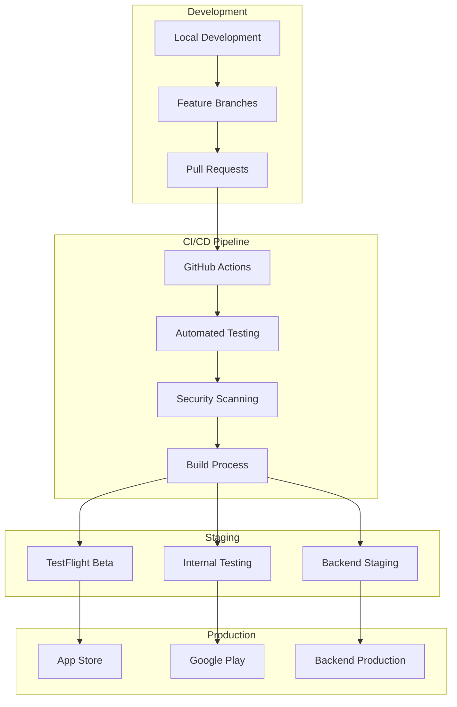

# Guide de déploiement

**Version** : 1.2.0  
**Dernière mise à jour** : 19 novembre 2025  
**Statut** : Production Ready

Procédures de déploiement en production et bonnes pratiques pour Arkalia CIA.

---

## Table des matières

1. [Overview](#overview)
2. [Deployment Architecture](#deployment-architecture)
3. [Prerequisites](#prerequisites)
4. [Mobile App Deployment](#mobile-app-deployment)
5. [Backend Deployment](#backend-deployment)
6. [Environment Configuration](#environment-configuration)
7. [Security Considerations](#security-considerations)
8. [Monitoring and Maintenance](#monitoring-and-maintenance)

---

## Overview

Arkalia CIA follows a **progressive deployment strategy** across three phases, prioritizing stability and user experience. This guide covers deployment for mobile applications and backend services.

## Deployment Architecture



## Prerequisites

### Development Environment

| Tool | Version | Purpose |
|------|---------|---------|
| Flutter | 3.35.3+ | Mobile app development |
| Dart | 3.0+ | Language runtime |
| Python | 3.10+ | Backend services |
| Node.js | 18+ | Build tools |
| Docker | 20+ | Containerization |

### Production Accounts

- **Apple Developer Account** (iOS deployment)
- **Google Play Console** (Android deployment)
- **Cloud Provider** (AWS/GCP/Azure for backend)
- **Domain & SSL** (Custom domain setup)

## Mobile App Deployment

### Environment Configuration

**Development**
```bash
# .env.development
FLUTTER_MODE=debug
API_BASE_URL=http://localhost:8000
ANALYTICS_ENABLED=false
```

**Production**
```bash
# .env.production
FLUTTER_MODE=release
API_BASE_URL=https://api.arkalia-cia.com
ANALYTICS_ENABLED=true
```

### Build Configuration

**Android Production Build**

> ⚠️ **IMPORTANT** : Pour éviter les problèmes de fichiers macOS cachés, utilisez le disque local pour le build.

```bash
# Copier sur disque local (une seule fois)
cd /Volumes/T7/arkalia-cia
rsync -av --exclude='build' --exclude='.dart_tool' --exclude='.git' --exclude='*.log' arkalia_cia/ ~/arkalia-cia-build/arkalia_cia/

# Clean previous builds
cd ~/arkalia-cia-build/arkalia_cia
flutter clean && flutter pub get

# Build signed APK
flutter build apk --release \
  --dart-define=FLAVOR=production \
  --target-platform android-arm64

# Build App Bundle (recommended)
flutter build appbundle --release \
  --dart-define=FLAVOR=production
```

**iOS Production Build**
```bash
# Clean previous builds
flutter clean && flutter pub get

# Build for iOS
flutter build ios --release \
  --dart-define=FLAVOR=production

# Open in Xcode for final steps
open ios/Runner.xcworkspace
```

### Code Signing

**Android Signing**
```bash
# Generate keystore (one-time setup)
keytool -genkey -v \
  -keystore arkalia-cia-release.jks \
  -keyalg RSA \
  -keysize 2048 \
  -validity 10000 \
  -alias arkalia-cia

# Configure signing in android/key.properties
storePassword=YOUR_STORE_PASSWORD
keyPassword=YOUR_KEY_PASSWORD
keyAlias=arkalia-cia
storeFile=../arkalia-cia-release.jks
```

**iOS Signing**
- Use Xcode's automatic signing for development
- Configure distribution certificates for production
- Enable App Store provisioning profiles

### Store Deployment

#### Google Play Store

**App Descriptions (Ready to Use)**

**Short Description (80 chars max):**
```
Assistant santé mobile sécurisé pour gérer documents médicaux et rappels
```

**Full Description:**
```
Arkalia CIA - Votre Assistant Santé Personnel

Arkalia CIA est une application mobile conçue pour vous aider à gérer vos documents médicaux, vos rappels de santé et vos contacts d'urgence de manière sécurisée et simple.

🔒 SÉCURITÉ MAXIMALE
• Chiffrement AES-256 pour tous vos documents
• Stockage 100% local sur votre appareil
• Aucune transmission de données
• Aucune collecte d'informations personnelles

📄 GESTION DE DOCUMENTS
• Importez et organisez vos PDF médicaux
• Recherche rapide dans vos documents
• Organisation par catégories
• Stockage sécurisé avec chiffrement

🔔 RAPPELS INTELLIGENTS
• Intégration avec votre calendrier
• Notifications personnalisées
• Rappels de médicaments
• Gestion des rendez-vous médicaux

🚨 CONTACTS D'URGENCE
• Contacts ICE (In Case of Emergency)
• Appel d'urgence en un clic
• Carte d'urgence médicale
• Informations de santé critiques

👵 ACCESSIBLE À TOUS
• Interface senior-friendly
• Boutons larges et texte clair
• Navigation intuitive
• Design adapté aux besoins des seniors

🌍 100% HORS-LIGNE
• Fonctionne sans connexion internet
• Vos données restent sur votre appareil
• Aucune dépendance cloud
• Respect total de votre vie privée

Arkalia CIA est développé par Arkalia Luna System avec un focus sur la sécurité, la simplicité et le respect de la vie privée.

Note médicale importante : Arkalia CIA est un outil d'organisation et ne remplace pas les conseils médicaux professionnels.
```

1. **Create App Listing**
   ```bash
   # Upload to Google Play Console
   # Use descriptions above
   # Add screenshots (see requirements below)
   ```

2. **Upload Build**
   ```bash
   # Upload AAB file through console
   # Configure release notes and rollout percentage
   ```

3. **Screenshots Requirements**
   - Phone: 1080 x 1920 pixels minimum
   - 7-inch Tablet: 1200 x 1920 pixels
   - 10-inch Tablet: 1600 x 2560 pixels
   - Feature Graphic: 1024 x 500 pixels
   - Minimum 2 screenshots required
   - **Guide détaillé**: Voir `docs/SCREENSHOTS_GUIDE.md` pour savoir exactement quels écrans capturer

4. **Privacy Policy & Terms**
   - Privacy Policy URL: (à héberger et ajouter)
   - Terms of Service URL: (à héberger et ajouter)
   - Files available: `PRIVACY_POLICY.txt` and `TERMS_OF_SERVICE.txt`

5. **Release Management**
   - Start with 5% rollout
   - Monitor crash reports and user feedback
   - Gradually increase to 100%

#### Apple App Store

**App Descriptions (Ready to Use)**

**Subtitle (30 chars max):**
```
Assistant santé sécurisé
```

**Promotional Text (170 chars max):**
```
Gérez vos documents médicaux et rappels de santé en toute sécurité. 100% hors-ligne, chiffrement AES-256, interface senior-friendly.
```

**Description:**
```
Arkalia CIA - Votre Assistant Santé Personnel

Arkalia CIA est une application mobile conçue pour vous aider à gérer vos documents médicaux, vos rappels de santé et vos contacts d'urgence de manière sécurisée et simple.

🔒 SÉCURITÉ MAXIMALE
• Chiffrement AES-256 pour tous vos documents
• Stockage 100% local sur votre appareil
• Aucune transmission de données
• Aucune collecte d'informations personnelles

📄 GESTION DE DOCUMENTS
• Importez et organisez vos PDF médicaux
• Recherche rapide dans vos documents
• Organisation par catégories
• Stockage sécurisé avec chiffrement

🔔 RAPPELS INTELLIGENTS
• Intégration avec votre calendrier
• Notifications personnalisées
• Rappels de médicaments
• Gestion des rendez-vous médicaux

🚨 CONTACTS D'URGENCE
• Contacts ICE (In Case of Emergency)
• Appel d'urgence en un clic
• Carte d'urgence médicale
• Informations de santé critiques

👵 ACCESSIBLE À TOUS
• Interface senior-friendly
• Boutons larges et texte clair
• Navigation intuitive
• Design adapté aux besoins des seniors

🌍 100% HORS-LIGNE
• Fonctionne sans connexion internet
• Vos données restent sur votre appareil
• Aucune dépendance cloud
• Respect total de votre vie privée

Arkalia CIA est développé par Arkalia Luna System avec un focus sur la sécurité, la simplicité et le respect de la vie privée.

Note médicale importante : Arkalia CIA est un outil d'organisation et ne remplace pas les conseils médicaux professionnels.
```

**Keywords (100 chars max):**
```
santé,médical,documents,rappels,urgence,senior,privacy,chiffrement,local,offline
```

1. **App Store Connect Setup**
   ```bash
   # Create app record in App Store Connect
   # Use descriptions above
   # Add screenshots (see requirements below)
   ```

2. **TestFlight Beta**
   ```bash
   # Upload build via Xcode or Transporter
   # Add beta testers for internal testing
   ```

3. **Screenshots Requirements**
   - iPhone 6.7" (iPhone 14 Pro Max): 1290 x 2796 pixels
   - iPhone 6.5" (iPhone 11 Pro Max): 1242 x 2688 pixels
   - iPhone 5.5" (iPhone 8 Plus): 1242 x 2208 pixels
   - iPad Pro 12.9": 2048 x 2732 pixels
   - Minimum 3 screenshots required per device size
   - **Guide détaillé**: Voir `docs/SCREENSHOTS_GUIDE.md` pour savoir exactement quels écrans capturer

4. **Privacy Policy & Terms**
   - Privacy Policy URL: (à héberger et ajouter)
   - Terms of Service URL: (à héberger et ajouter)
   - Files available: `PRIVACY_POLICY.txt` and `TERMS_OF_SERVICE.txt`

5. **Production Release**
   - Submit for App Store review
   - Monitor review status
   - Release after approval

## Backend Deployment

### Containerization

**Dockerfile**
```dockerfile
FROM python:3.10-slim

WORKDIR /app

# Install dependencies
COPY requirements.txt .
RUN pip install --no-cache-dir -r requirements.txt

# Copy application
COPY arkalia_cia_python_backend/ .

# Security: Non-root user
RUN adduser --disabled-password --gecos '' appuser
USER appuser

# Health check
HEALTHCHECK --interval=30s --timeout=10s --start-period=5s --retries=3 \
  CMD curl -f http://localhost:8000/health || exit 1

EXPOSE 8000
CMD ["uvicorn", "api:app", "--host", "0.0.0.0", "--port", "8000"]
```

**Docker Compose (Development)**
```yaml
version: '3.8'
services:
  api:
    build: .
    ports:
      - "8000:8000"
    environment:
      - DATABASE_URL=sqlite:///./arkalia_cia.db
      - DEBUG=true
    volumes:
      - ./uploads:/app/uploads
      - ./logs:/app/logs

  db:
    image: postgres:15
    environment:
      - POSTGRES_DB=arkalia_cia
      - POSTGRES_USER=arkalia_user
      - POSTGRES_PASSWORD=secure_password
    volumes:
      - postgres_data:/var/lib/postgresql/data

volumes:
  postgres_data:
```

### Cloud Deployment

#### AWS Deployment

**ECS with Fargate**
```bash
# Build and push image
docker build -t arkalia-cia-backend .
docker tag arkalia-cia-backend:latest \
  YOUR_ECR_REPO/arkalia-cia-backend:latest
docker push YOUR_ECR_REPO/arkalia-cia-backend:latest

# Deploy with ECS
aws ecs update-service \
  --cluster arkalia-cia-cluster \
  --service arkalia-cia-service \
  --force-new-deployment
```

**RDS Configuration**
```bash
# Create RDS instance
aws rds create-db-instance \
  --db-instance-identifier arkalia-cia-db \
  --db-instance-class db.t3.micro \
  --engine postgres \
  --master-username arkalia_user \
  --master-user-password SECURE_PASSWORD \
  --allocated-storage 20
```

#### Google Cloud Platform

**Cloud Run Deployment**
```bash
# Deploy to Cloud Run
gcloud run deploy arkalia-cia-backend \
  --image gcr.io/PROJECT_ID/arkalia-cia-backend \
  --platform managed \
  --region us-central1 \
  --allow-unauthenticated
```

#### Kubernetes Deployment

```yaml
apiVersion: apps/v1
kind: Deployment
metadata:
  name: arkalia-cia-backend
spec:
  replicas: 3
  selector:
    matchLabels:
      app: arkalia-cia-backend
  template:
    metadata:
      labels:
        app: arkalia-cia-backend
    spec:
      containers:
      - name: backend
        image: arkalia-cia-backend:latest
        ports:
        - containerPort: 8000
        env:
        - name: DATABASE_URL
          valueFrom:
            secretKeyRef:
              name: db-secret
              key: url
        resources:
          requests:
            memory: "256Mi"
            cpu: "250m"
          limits:
            memory: "512Mi"
            cpu: "500m"
```

## Database Management

### Migration Strategy

```python
# migrations/001_initial_schema.py
from alembic import op
import sqlalchemy as sa

def upgrade():
    op.create_table('documents',
        sa.Column('id', sa.Integer, primary_key=True),
        sa.Column('name', sa.String(255), nullable=False),
        sa.Column('file_path', sa.String(500), nullable=False),
        sa.Column('created_at', sa.DateTime, default=sa.func.now()),
    )

def downgrade():
    op.drop_table('documents')
```

### Backup Procedures

```bash
# PostgreSQL backup
pg_dump -h localhost -U arkalia_user -d arkalia_cia \
  --clean --if-exists --create \
  --format=custom \
  --file=backup_$(date +%Y%m%d_%H%M%S).dump

# Restore from backup
pg_restore -h localhost -U arkalia_user \
  --clean --if-exists --create \
  --dbname=arkalia_cia \
  backup_20241213_143000.dump
```

## Monitoring & Observability

### Application Monitoring

**Health Checks**
```python
@app.get("/health")
async def health_check():
    return {
        "status": "healthy",
        "timestamp": datetime.utcnow().isoformat(),
        "version": "1.0.0",
        "database": await check_database_connection(),
        "disk_space": get_disk_usage(),
    }
```

**Metrics Collection**
```python
from prometheus_client import Counter, Histogram, generate_latest

REQUEST_COUNT = Counter('requests_total', 'Total requests', ['method', 'endpoint'])
REQUEST_DURATION = Histogram('request_duration_seconds', 'Request duration')

@app.middleware("http")
async def add_metrics(request: Request, call_next):
    start_time = time.time()
    response = await call_next(request)
    duration = time.time() - start_time

    REQUEST_COUNT.labels(request.method, request.url.path).inc()
    REQUEST_DURATION.observe(duration)

    return response
```

### Logging Configuration

```python
import logging
from pythonjsonlogger import jsonlogger

# Structured logging
logHandler = logging.StreamHandler()
formatter = jsonlogger.JsonFormatter(
    fmt='%(asctime)s %(name)s %(levelname)s %(message)s'
)
logHandler.setFormatter(formatter)
logger = logging.getLogger()
logger.addHandler(logHandler)
logger.setLevel(logging.INFO)
```

## Security Hardening

### SSL/TLS Configuration

```nginx
# nginx.conf
server {
    listen 443 ssl http2;
    server_name api.arkalia-cia.com;

    ssl_certificate /etc/ssl/certs/arkalia-cia.crt;
    ssl_certificate_key /etc/ssl/private/arkalia-cia.key;

    ssl_protocols TLSv1.2 TLSv1.3;
    ssl_ciphers ECDHE-RSA-AES256-GCM-SHA512:DHE-RSA-AES256-GCM-SHA512;
    ssl_prefer_server_ciphers off;

    add_header Strict-Transport-Security "max-age=63072000" always;
    add_header X-Content-Type-Options nosniff;
    add_header X-Frame-Options DENY;

    location / {
        proxy_pass http://localhost:8000;
        proxy_set_header Host $host;
        proxy_set_header X-Real-IP $remote_addr;
    }
}
```

### Environment Secrets

```bash
# Use secret management systems
export DATABASE_URL=$(aws ssm get-parameter \
  --name "/arkalia-cia/database-url" \
  --with-decryption \
  --query "Parameter.Value" \
  --output text)
```

## Rollback Procedures

### Application Rollback

```bash
# Mobile app rollback (emergency)
# Use store console to unpublish problematic version

# Backend rollback
kubectl rollout undo deployment/arkalia-cia-backend

# Or with specific revision
kubectl rollout undo deployment/arkalia-cia-backend --to-revision=2
```

### Database Rollback

```bash
# Run down migration
alembic downgrade -1

# Or restore from backup
pg_restore -h localhost -U arkalia_user \
  --clean --if-exists \
  --dbname=arkalia_cia \
  backup_last_known_good.dump
```

## Performance Optimization

### Mobile App Optimization

```dart
// Lazy loading for better performance
class DocumentList extends StatelessWidget {
  @override
  Widget build(BuildContext context) {
    return ListView.builder(
      itemCount: documents.length,
      itemBuilder: (context, index) {
        return FutureBuilder(
          future: loadDocumentThumbnail(documents[index]),
          builder: (context, snapshot) {
            return DocumentTile(document: documents[index]);
          },
        );
      },
    );
  }
}
```

### Backend Optimization

```python
# Connection pooling
from sqlalchemy.pool import QueuePool

engine = create_engine(
    DATABASE_URL,
    poolclass=QueuePool,
    pool_size=20,
    max_overflow=0,
    pool_pre_ping=True,
)

# Caching
from functools import lru_cache

@lru_cache(maxsize=1000)
async def get_document_metadata(doc_id: int):
    # Expensive operation cached
    return await fetch_document_metadata(doc_id)
```

## Troubleshooting

### Common Issues

| Issue | Symptoms | Solution |
|-------|----------|----------|
| Build failures | Compilation errors | Clean build cache, update dependencies |
| Memory leaks | App crashes, slow performance | Profile memory usage, fix leaks |
| Network timeouts | API failures | Increase timeout, add retry logic |
| Database locks | Slow queries | Optimize queries, add indexes |

### Debug Commands

```bash
# Mobile app debugging
flutter logs
adb logcat | grep arkalia

# Backend debugging
docker logs arkalia-cia-backend --tail=100 --follow

# Database debugging
EXPLAIN ANALYZE SELECT * FROM documents WHERE user_id = 123;
```

## Maintenance Windows

### Scheduled Maintenance

1. **Notification**: 48 hours advance notice
2. **Timing**: Low-traffic periods (2-4 AM UTC)
3. **Duration**: Maximum 2 hours
4. **Rollback**: Ready within 15 minutes

### Zero-Downtime Deployments

```bash
# Blue-green deployment
kubectl apply -f deployment-green.yaml
kubectl patch service arkalia-cia-service -p '{"spec":{"selector":{"version":"green"}}}'

# Canary deployment
kubectl apply -f canary-deployment.yaml
# Monitor metrics, gradually shift traffic
```

---

## 📚 Related Documentation

- **[ARCHITECTURE.md](ARCHITECTURE.md)** - System architecture
- **[API.md](API.md)** - API reference
- **[SECURITY.md](../SECURITY.md)** - Security policies
- **[INDEX_DOCUMENTATION.md](INDEX_DOCUMENTATION.md)** - Full documentation index

---

**Last Updated**: November 19, 2025  
*This deployment guide is updated with each release. For support, contact [our team](mailto:arkalia.luna.system@gmail.com).*
