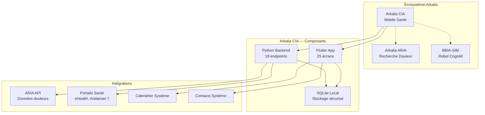
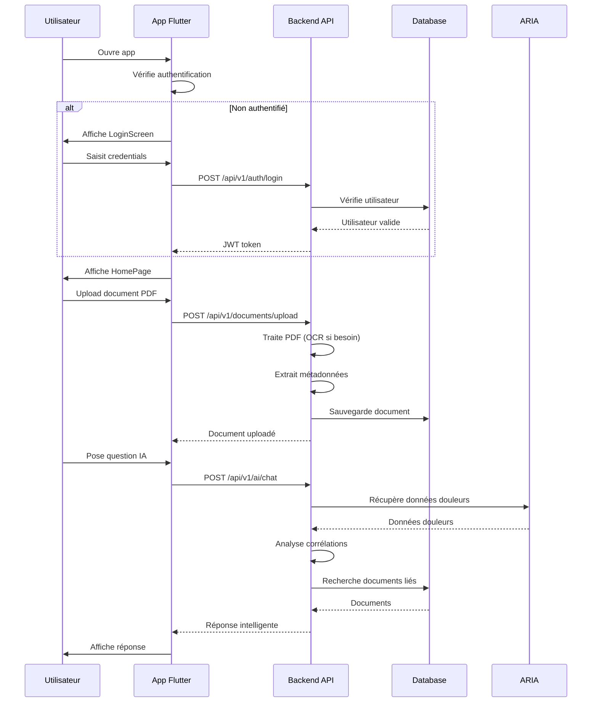
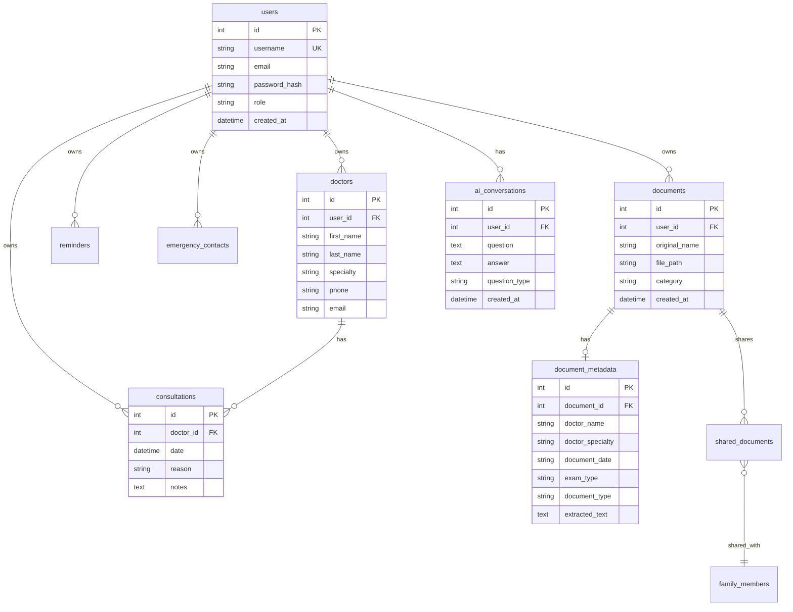
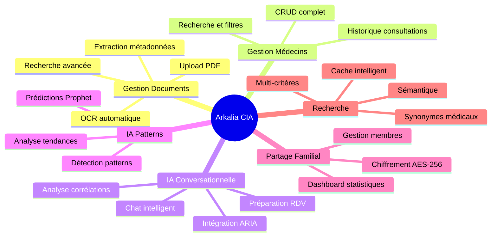
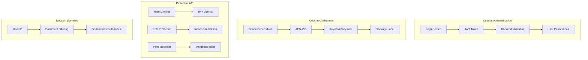
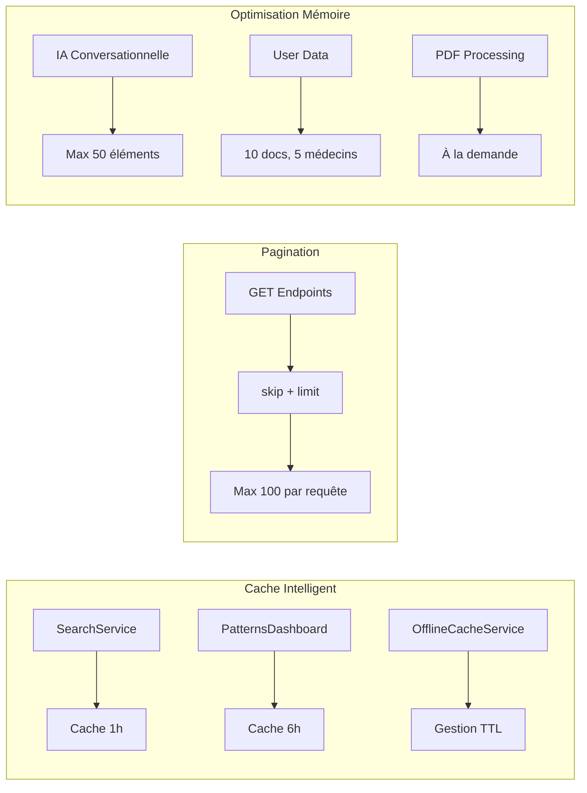
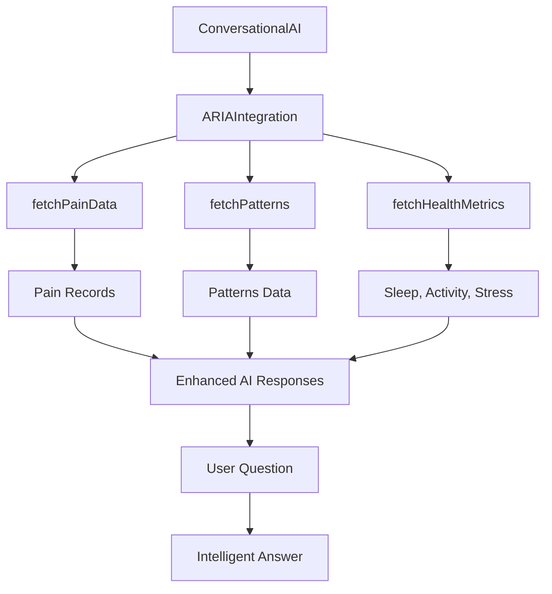
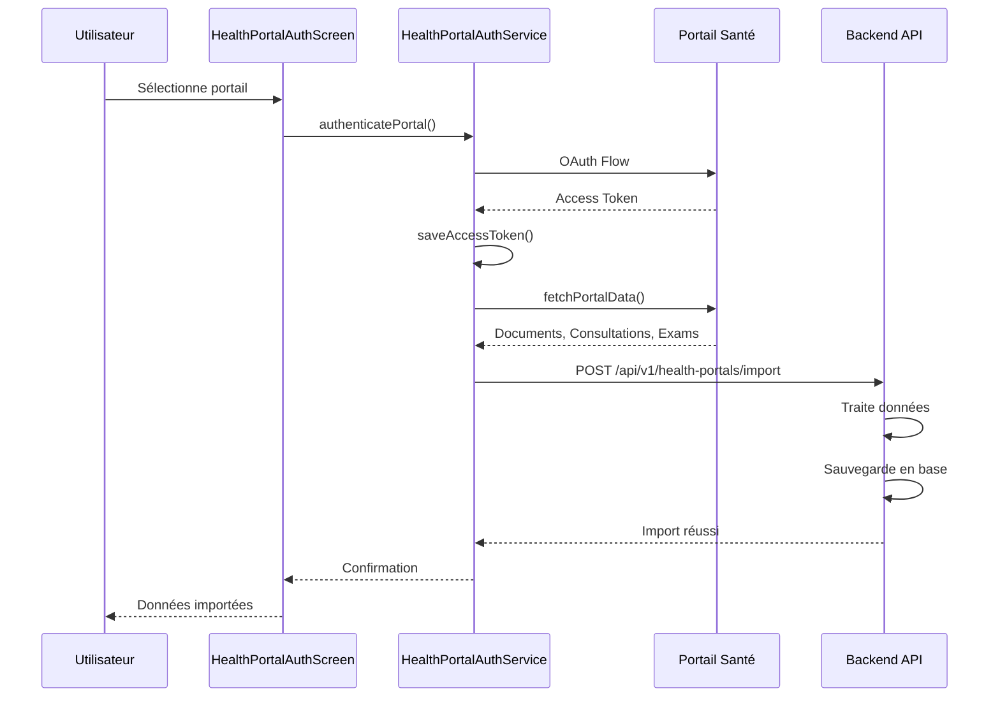

# Vue d'ensemble du projet — Arkalia CIA

**Version** : 1.3.1  
**Dernière mise à jour** : Janvier 2025

Document de synthèse visuelle présentant l'écosystème complet Arkalia CIA.

---

## Table des matières

1. [Architecture globale](#architecture-globale)
2. [Flux utilisateur principal](#flux-utilisateur-principal)
3. [Composants techniques](#composants-techniques)
4. [Intégrations](#intégrations)
5. [Flux de données](#flux-de-données)
6. [Voir aussi](#voir-aussi)

---

## Architecture globale

---

## Flux utilisateur principal

---

## Structure des données

---

## Fonctionnalités par module

---

## Sécurité et confidentialité

---

## Performance et optimisation

---

## Intégrations externes

### ARIA Integration

### Portails Santé

---

## Statistiques du projet

### Code

- **Backend Python** : 18 endpoints, 8 modules principaux
- **Frontend Flutter** : 25 écrans, 21 services, 6 utils
- **Tests** : 206 tests Python (100% passent), 85% couverture
- **Documentation** : 94 fichiers MD organisés

### Fonctionnalités

- **Gestion Documents** : Upload, OCR, métadonnées, recherche
- **Gestion Médecins** : CRUD complet, historique, statistiques
- **IA Conversationnelle** : Chat intelligent avec ARIA
- **IA Patterns** : Détection patterns, prédictions Prophet
- **Partage Familial** : Chiffrement AES-256, dashboard
- **Recherche** : Multi-critères, sémantique, cache

---

## Roadmap

### Court terme (Q1 2026)
- Tests manuels sur devices réels
- Build release Android
- Screenshots iOS

### Moyen terme (Q2-Q3 2026)
- Import automatique portails santé (APIs externes)
- Recherche NLP avancée (modèles ML)
- Graphiques interactifs patterns

### Long terme (2027+)
- Intégration robotique BBIA
- Application web complémentaire
- Modèles ML supplémentaires (LSTM)

---

## Voir aussi

- **[ARCHITECTURE.md](./ARCHITECTURE.md)** — Architecture technique détaillée
- **[API_DOCUMENTATION.md](./API_DOCUMENTATION.md)** — Documentation complète de l'API
- **[STATUT_FINAL_CONSOLIDE.md](./STATUT_FINAL_CONSOLIDE.md)** — Statut final consolidé du projet
- **[ANALYSE_COMPLETE_BESOINS_MERE.md](./ANALYSE_COMPLETE_BESOINS_MERE.md)** — Analyse complète des besoins
- **[INDEX_DOCUMENTATION.md](./INDEX_DOCUMENTATION.md)** — Index complet de la documentation

---

*Dernière mise à jour : Janvier 2025*

