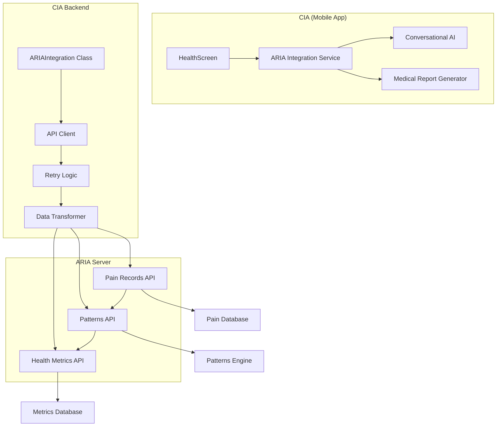

# Intégration ARIA - Vision Clinique et Technique

**Version** : 1.0.0  
**Date** : 27 novembre 2025 | **Mise à jour** : 12 décembre 2025  
**Statut** : Production Ready

---

## ⚠️ IMPORTANT - Architecture Séparée

**ARIA est un projet SÉPARÉ de CIA** :
- ✅ **CIA** : Projet principal (`arkalia-cia`) - Assistant santé généraliste
- ✅ **ARIA** : Projet séparé (`arkalia-aria`) - Laboratoire personnel douleur/mental
- ✅ **Communication** : Via API HTTP (CIA ↔ ARIA)
- ✅ **Déploiement** : CIA sur GitHub Pages (PWA), ARIA sur Render.com (serveur Python)

**Pourquoi séparé ?**
- Séparation des responsabilités (coffre-fort vs microscope)
- Maintenance indépendante
- Évolutivité indépendante
- Déploiement indépendant

**⚠️ Ne pas développer ARIA dans le projet CIA** - Utiliser le projet ARIA séparé.


---

## Vue d'ensemble

**Arkalia ARIA** (Arkalia Research Intelligence Assistant) est le laboratoire personnel de santé qui se concentre sur le suivi fin de la douleur chronique et l'analyse de patterns psychologiques. **Arkalia CIA** (Conversational Intelligence Assistant) est l'assistant santé généraliste qui gère les documents médicaux, rappels, contacts d'urgence.

Cette intégration permet de combiner la **vision macro** (CIA) avec la **vision micro** (ARIA) pour offrir une compréhension complète de la santé de l'utilisateur.

---

## 🎯 Vision Clinique

### Positionnement des deux systèmes

| Aspect | **CIA** (Assistant Généraliste) | **ARIA** (Laboratoire Personnel) |
|--------|----------------------------------|----------------------------------|
| **Rôle** | Coffre-fort santé + rappels + urgence | Microscope douleur + mental |
| **Données** | Documents médicaux, consultations, examens | Entrées douleur fine-grain, patterns psy, métriques |
| **Granularité** | Agrégats, résumés, documents complets | Données temporelles détaillées, corrélations |
| **Utilisation** | Gestion quotidienne, RDV médicaux | Recherche personnelle, compréhension patterns |
| **Export** | Documents PDF, rapports médicaux | Timeline douleur, analyses patterns, métriques |

### Scénarios d'utilisation clinique

#### 1. **Avant une consultation médicale**

**Problème** : Le patient arrive chez le médecin sans pouvoir se souvenir précisément de ses douleurs, de leur fréquence, ou des déclencheurs.

**Solution avec CIA + ARIA** :
1. L'utilisateur a noté ses douleurs quotidiennement dans ARIA
2. Avant le RDV, CIA récupère les données ARIA pertinentes
3. CIA génère un **rapport résumé** combinant :
   - Documents médicaux pertinents (CIA)
   - Timeline douleur des 30 derniers jours (ARIA)
   - Patterns détectés (corrélations météo, sommeil, stress) (ARIA)
   - Résumé des consultations précédentes (CIA)
4. Le médecin reçoit un document structuré au lieu d'un "je ne sais pas trop"

**Exemple de rapport généré** :
```
RAPPORT MÉDICAL - Consultation du 23/11/2025
============================================

DOCUMENTS MÉDICAUX (CIA)
- Analyse sanguine du 15/10/2025
- Radiographie genou du 20/09/2025
- Ordonnance médicaments actuelle

TIMELINE DOULEUR (ARIA - 30 derniers jours)
- Intensité moyenne : 6.2/10
- Pic douleur : 8/10 (12/11/2025, 14h30)
- Localisation principale : Genou droit (78% des entrées)
- Déclencheurs fréquents : Activité physique (45%), Météo froide (32%)

PATTERNS DÉTECTÉS (ARIA)
- Corrélation forte : Douleur ↑ après sommeil <6h (corrélation 0.78)
- Saisonnalité : Douleur ↑ en automne/hiver
- Médication : Efficacité réduite les jours de stress élevé

MÉTRIQUES SANTÉ (ARIA)
- Sommeil moyen : 6.2h/jour (objectif : 7h)
- Niveau stress : Élevé (7.1/10)
- Activité physique : Réduite (-23% vs mois précédent)
```

#### 2. **Suivi quotidien avec contexte enrichi**

**Problème** : L'utilisateur veut comprendre pourquoi il a mal aujourd'hui, mais les informations sont dispersées.

**Solution avec CIA + ARIA** :
1. L'utilisateur note sa douleur dans ARIA (intensité 7/10, genou droit, après marche)
2. L'IA conversationnelle de CIA peut maintenant répondre avec contexte :
   - "Je vois que tu as noté une douleur de 7/10 au genou droit après une marche. D'après tes données ARIA, c'est similaire à ce que tu as ressenti il y a 2 semaines. À cette occasion, tu avais pris ton anti-inflammatoire et la douleur avait diminué en 2 heures. Veux-tu que je te rappelle de prendre ton médicament ?"
3. CIA utilise les documents médicaux pour suggérer des actions appropriées

#### 3. **Détection de patterns pour prévention**

**Problème** : L'utilisateur ne réalise pas que ses douleurs sont liées à certains facteurs (sommeil, stress, météo).

**Solution avec ARIA → CIA** :
1. ARIA détecte un pattern : "Douleur ↑ de 40% les jours où sommeil <6h"
2. ARIA envoie cette information à CIA
3. CIA peut maintenant :
   - Suggérer des rappels pour améliorer le sommeil
   - Avertir l'utilisateur : "Attention, tu n'as dormi que 5h30 cette nuit. D'après tes patterns, tu risques d'avoir plus de douleur aujourd'hui."
   - Préparer un rapport pour le médecin avec ces corrélations

---

## 🔄 Flux de données

### CIA → ARIA (Données agrégées)

**Ce que CIA envoie à ARIA** :
- Documents médicaux pertinents (extraits, métadonnées)
- Dates de consultations
- Médicaments prescrits
- Examens réalisés

**Pourquoi** : ARIA peut corréler les douleurs avec les événements médicaux (ex: "Douleur ↑ 3 jours après prise de médicament X")

**Format** : Agrégats, pas de détails intimes sauf si l'utilisateur choisit de partager

### ARIA → CIA (Données fines)

**Ce que ARIA envoie à CIA** :
- **Enregistrements douleur** : Intensité (0-10), localisation, qualité (brûlure, élancement), contexte (heure, activité, sommeil, stress)
- **Patterns détectés** : Corrélations (météo, sommeil, stress, alimentation), saisonnalité, tendances
- **Métriques santé** : Sommeil, activité, stress, humeur

**Pourquoi** : Enrichir l'IA conversationnelle de CIA avec le contexte douleur, préparer des rapports médicaux complets

**Format** : Données temporelles détaillées, analyses statistiques

### Exemple de synchronisation

```python
# Scénario : Avant un RDV médical
# 1. CIA demande les données pertinentes à ARIA
aria_data = {
    "pain_records": [
        {
            "timestamp": "2025-11-23T14:30:00",
            "intensity": 8,
            "location": "Genou droit",
            "trigger": "Activité physique",
            "context": {
                "sleep_hours": 5.5,
                "stress_level": 7,
                "weather": "Froid, humide"
            }
        },
        # ... autres entrées
    ],
    "patterns": {
        "sleep_correlation": 0.78,
        "weather_correlation": 0.65,
        "seasonal_trend": "↑ en automne/hiver"
    },
    "health_metrics": {
        "avg_sleep_30d": 6.2,
        "avg_stress_30d": 7.1,
        "activity_trend": "↓ -23%"
    }
}

# 2. CIA combine avec ses propres données
cia_documents = get_relevant_documents(date_range="30d")
cia_consultations = get_consultations(date_range="30d")

# 3. CIA génère un rapport structuré
medical_report = generate_report(
    documents=cia_documents,
    consultations=cia_consultations,
    pain_data=aria_data,
    format="pdf"
)
```

---

## 🏗️ Architecture Technique

### Composants d'intégration



### Endpoints ARIA utilisés par CIA

| Endpoint | Méthode | Description | Données retournées |
|----------|---------|-------------|-------------------|
| `/api/pain-records` | GET | Enregistrements douleur | Liste d'entrées avec intensité, localisation, contexte |
| `/api/patterns` | GET | Patterns détectés | Corrélations, tendances, saisonnalité |
| `/api/health-metrics` | GET | Métriques santé | Sommeil, activité, stress, humeur |

### Gestion des erreurs

**Stratégie** : Graceful degradation
- Si ARIA n'est pas disponible → CIA fonctionne normalement sans données ARIA
- Retry logic avec exponential backoff (3 tentatives max)
- Timeout de 5 secondes par requête
- Logs en mode debug uniquement (pas de logs en production)

**Code exemple** :
```python
def get_pain_records(self, user_id: str, limit: int = 10):
    try:
        response = self.session.get(
            f"{self.aria_base_url}/api/pain-records",
            params={"user_id": str(user_id), "limit": str(limit)},
            timeout=5,
        )
        if response.status_code == 200:
            return response.json().get("records", [])
        return []  # Retourner liste vide si erreur
    except Exception:
        return []  # ARIA non disponible, continuer sans
```

---

## 🔐 Confidentialité et Contrôle Utilisateur

### Principe : Local-First + Consentement Explicite

1. **Données restent locales** : Par défaut, aucune synchronisation automatique
2. **Consentement requis** : L'utilisateur doit activer explicitement la synchronisation CIA ↔ ARIA
3. **Filtrage utilisateur** : L'utilisateur peut choisir quelles données partager
   - Exemple : "Partager mes patterns mais pas mes entrées douleur détaillées"
4. **Anonymisation optionnelle** : Pour export médical, possibilité d'anonymiser certaines données

### Exemple de configuration utilisateur

```dart
// Dans les paramètres CIA
ARIAIntegrationSettings(
  enabled: true,  // L'utilisateur a activé l'intégration
  sharePainRecords: true,  // Partager les entrées douleur
  sharePatterns: true,  // Partager les patterns détectés
  shareHealthMetrics: false,  // Ne pas partager les métriques détaillées
  anonymizeForExport: true,  // Anonymiser pour export médical
)
```

---

## 📊 Exemples de Données Échangées

### 1. Enregistrements douleur (ARIA → CIA)

```json
{
  "records": [
    {
      "id": "pain_001",
      "timestamp": "2025-11-23T14:30:00Z",
      "intensity": 8,
      "location": "Genou droit",
      "quality": "Élancement",
      "trigger": "Activité physique",
      "context": {
        "sleep_hours": 5.5,
        "stress_level": 7,
        "weather": "Froid, humide",
        "medication_taken": ["Ibuprofène 400mg"],
        "activity_before": "Marche 30min"
      },
      "duration_minutes": 120,
      "relief_method": "Repos + glace"
    }
  ]
}
```

### 2. Patterns détectés (ARIA → CIA)

```json
{
  "patterns": {
    "sleep_correlation": {
      "correlation": 0.78,
      "description": "Douleur ↑ de 40% les jours où sommeil <6h",
      "confidence": "High",
      "sample_size": 45
    },
    "weather_correlation": {
      "correlation": 0.65,
      "description": "Douleur ↑ en temps froid/humide",
      "confidence": "Medium",
      "sample_size": 30
    },
    "seasonal_trend": {
      "trend": "↑ en automne/hiver",
      "amplitude": "+2.3 points moyenne",
      "confidence": "High"
    }
  }
}
```

### 3. Métriques santé (ARIA → CIA)

```json
{
  "metrics": {
    "sleep": {
      "avg_30d": 6.2,
      "target": 7.0,
      "trend": "↓ -0.5h vs mois précédent"
    },
    "stress": {
      "avg_30d": 7.1,
      "scale": "0-10",
      "trend": "↑ +0.8 vs mois précédent"
    },
    "activity": {
      "avg_30d": 4200,
      "unit": "steps/day",
      "trend": "↓ -23% vs mois précédent"
    }
  }
}
```

---

## 🚀 Utilisation dans l'Application

### Pour l'utilisateur

1. **Configuration** : Aller dans Paramètres → ARIA Integration
2. **Activer** : Activer la synchronisation CIA ↔ ARIA
3. **Utilisation automatique** : Les données sont synchronisées en arrière-plan
4. **Export médical** : Utiliser la fonction "Générer rapport médical" avant un RDV

### Pour les développeurs

**Intégration dans le code** :
```dart
// Dans ConversationalAIService
final ariaIntegration = ARIAIntegration();
final painRecords = await ariaIntegration.getPainRecords(userId);
final patterns = await ariaIntegration.getPatterns(userId);

// Enrichir le contexte de l'IA
final context = {
  'pain_records': painRecords,
  'patterns': patterns,
  'documents': ciaDocuments,
};

final response = await conversationalAI.ask(
  question: userQuestion,
  context: context,
);
```

---

## 📈 Roadmap d'Amélioration

### Phase actuelle (v1.0) ✅
- ✅ Synchronisation basique CIA ↔ ARIA
- ✅ Récupération données douleur
- ✅ Enrichissement IA conversationnelle avec patterns ARIA
- ✅ **Génération de rapports médicaux pré-consultation** (implémenté)
  - Service backend `MedicalReportService`
  - Endpoint API `/api/v1/medical-reports/generate`
  - Interface Flutter `MedicalReportScreen`
  - Partage de rapports (texte formaté)
  - Combinaison CIA (documents) + ARIA (douleur, patterns, métriques)
- ✅ Tests unitaires et d'intégration complets

### Phase 2 (Q1 2026)
- 🔄 Export PDF des rapports médicaux
- 🔄 Génération automatique de rapports avant RDV (notifications)
- 🔄 Détection proactive de patterns critiques
- 🔄 Suggestions personnalisées basées sur patterns

### Phase 3 (Q2 2026)
- 📋 Intégration BBIA (robot compagnon)
- 📋 Partage familial sécurisé avec filtres ARIA
- 📋 Export multi-format (PDF, CSV, JSON)

---

## 🔗 Voir aussi

### Documentation CIA
- **[README.md](../README.md)** — Vue d'ensemble du projet CIA
- **[ARIA_IMPLEMENTATION_GUIDE.md](./ARIA_IMPLEMENTATION_GUIDE.md)** — Guide technique d'implémentation
- **[API_DOCUMENTATION.md](./API_DOCUMENTATION.md)** — Documentation API complète
- **[ARCHITECTURE.md](./ARCHITECTURE.md)** — Architecture système
- **[ECOSYSTEM_VISION.md](./ECOSYSTEM_VISION.md)** — Vision stratégique écosystème Arkalia Luna
- **[../analysis/USE_CASES.md](../analysis/USE_CASES.md)** — Cas d'usage concrets par profils utilisateurs

### Documentation ARIA
- **[README ARIA](https://github.com/arkalia-luna-system/arkalia-aria/blob/main/README.md)** — Vue d'ensemble du projet ARIA
- Documentation complète sur le [repo ARIA](https://github.com/arkalia-luna-system/arkalia-aria)

---

**Dernière mise à jour** : 27 novembre 2025  
**Maintenu par** : Arkalia Luna System

