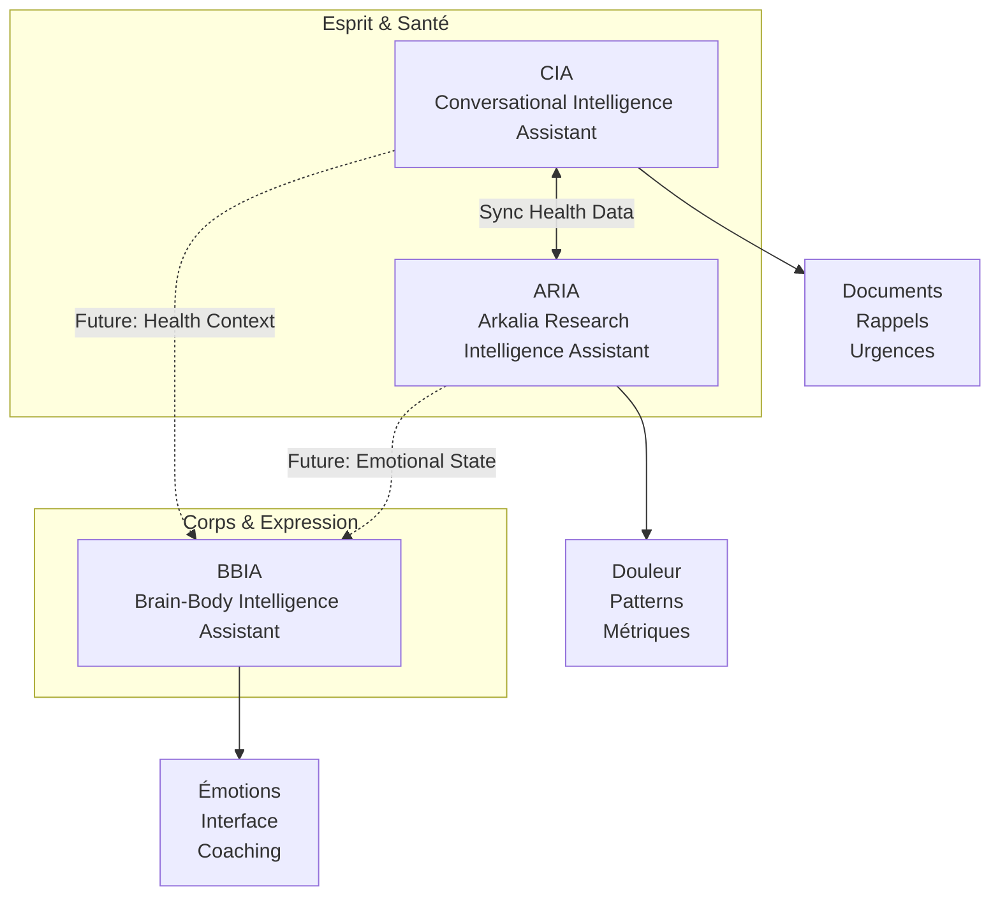

# Vision Écosystème Arkalia Luna System

**Version** : 1.0.0  
**Date** : 27 novembre 2025  
**Statut** : Vision Stratégique

---

## 🎯 Vue d'ensemble

**Arkalia Luna System** est un écosystème modulaire de santé personnelle centré sur le **patient et sa famille**, contrairement aux solutions existantes souvent centrées sur les professionnels de santé ou les institutions.

### Principe Fondamental

> **"L'utilisateur contrôle totalement ses données, avec des outils qui travaillent pour lui, pas contre lui."**

---

## 🏗️ Architecture Modulaire

### Les Trois Piliers



### Positionnement de Chaque Composant

| Composant | Rôle | Métaphore | Données |
|-----------|------|-----------|---------|
| **CIA** | Assistant santé généraliste | "Coffre-fort santé" | Documents médicaux, rappels, contacts urgence, agrégats |
| **ARIA** | Laboratoire personnel | "Microscope douleur/mental" | Données douleur fine-grain, patterns psychologiques, métriques |
| **BBIA** | Robot compagnon cognitif | "Corps/visage expressif" | Émotions robotiques, comportements adaptatifs, interface incarnée |

---

## 🔄 Flux de Données

### CIA ↔ ARIA (Intégration Principale)

**CIA → ARIA** (Données agrégées) :
- Documents médicaux pertinents (extraits, métadonnées)
- Dates de consultations
- Médicaments prescrits
- Examens réalisés

**Pourquoi** : ARIA peut corréler les douleurs avec les événements médicaux

**ARIA → CIA** (Données fines) :
- Enregistrements douleur (intensité, localisation, contexte)
- Patterns détectés (corrélations, saisonnalité, tendances)
- Métriques santé (sommeil, activité, stress)

**Pourquoi** : Enrichir l'IA conversationnelle de CIA, préparer rapports médicaux

**Exemple concret** :
```
Scénario : Avant un RDV médical
1. ARIA détecte pattern : "Douleur ↑ 40% les jours où sommeil <6h"
2. ARIA envoie cette info à CIA
3. CIA génère rapport combinant :
   - Documents médicaux (CIA)
   - Timeline douleur 30 jours (ARIA)
   - Patterns détectés (ARIA)
   - Résumé consultations (CIA)
4. Médecin reçoit document structuré au lieu de "je ne sais pas trop"
```

### CIA/ARIA → BBIA (Phase 4 - Future)

**Vision** : Le robot BBIA adapte son comportement émotionnel selon l'état santé détecté

**Exemples** :
- Si ARIA détecte douleur élevée → BBIA adopte un comportement plus doux, empathique
- Si CIA signale RDV médical proche → BBIA rappelle gentiment, propose de préparer les documents
- Si patterns ARIA montrent stress élevé → BBIA suggère exercices de relaxation

**Principe** : BBIA = "corps/visage" qui exprime les états de santé de façon robotique

---

## 🎯 Avantages Concurrentiels

### Comparaison avec Solutions Existantes

| Aspect | Solutions Existantes | Arkalia Luna System |
|--------|---------------------|---------------------|
| **Cible** | Professionnels médicaux / Hôpitaux | **Patient + Famille** (personnalisé) |
| **UX** | Complexe, technique | **Ultra-simple, senior-friendly** |
| **Contrôle** | Institutionnel | **Utilisateur contrôle total** |
| **Local-First** | Souvent cloud obligatoire | **100% local, optionnel cloud** |
| **Partage Familial** | Limité | **Contrôle granulaire complet** |
| **Modularité** | Monolithique | **Architecture modulaire** (CIA/ARIA/BBIA) |
| **Robotique** | Aucun | **Intégration BBIA** (Reachy Mini) |
| **Innovation** | Centré institution | **Dossier Patient IA centré patient/famille** |

### Innovation Clé

✅ **"Dossier Patient IA centré patient/famille"** - C'est rare et innovant !

La plupart des solutions santé sont conçues pour les professionnels. Arkalia inverse cette logique : **l'utilisateur est au centre**, avec des outils qui l'aident à comprendre et gérer sa santé.

---

## 📊 Matrice de Fonctionnalités

### Répartition des Rôles

| Fonctionnalité | CIA | ARIA | BBIA |
|----------------|-----|------|------|
| **Documents médicaux** | ✅ Principal | ⚠️ Contexte | ❌ |
| **Rappels santé** | ✅ Principal | ❌ | ⚠️ Future |
| **Contacts urgence** | ✅ Principal | ❌ | ⚠️ Future |
| **Suivi douleur** | ⚠️ Agrégats | ✅ Principal | ❌ |
| **Patterns psychologiques** | ⚠️ Contexte | ✅ Principal | ❌ |
| **Métriques santé** | ⚠️ Contexte | ✅ Principal | ❌ |
| **IA conversationnelle** | ✅ Principal | ⚠️ Enrichissement | ⚠️ Future |
| **Export médical** | ✅ Principal | ⚠️ Données fines | ❌ |
| **Interface robotique** | ❌ | ❌ | ✅ Principal |
| **Émotions adaptatives** | ❌ | ⚠️ Contexte | ✅ Principal |

**Légende** :
- ✅ **Principal** : Fonctionnalité principale du composant
- ⚠️ **Contexte/Support** : Utilisé pour enrichir ou supporter
- ❌ **Non applicable** : Pas dans le scope du composant

---

## 🚀 Roadmap Écosystème

### Phase Actuelle (v1.0)

**CIA** :
- ✅ Modules base (documents, santé, rappels, urgence)
- ✅ Intégration ARIA basique
- ✅ Interface senior-friendly
- ✅ Sécurité AES-256

**ARIA** :
- ✅ Tracking douleur
- ✅ Patterns détectés
- ✅ Métriques santé
- ✅ Sync CIA ↔ ARIA

**BBIA** :
- ✅ Robot cognitif stable
- ✅ Émotions robotiques
- ✅ Vision computer

### Phase 2 (Q1 2026)

**CIA** :
- 🔄 Génération automatique rapports médicaux avec contexte ARIA
- 🔄 Partage familial sécurisé
- 🔄 Import données externes (Andaman 7, MaSanté)

**ARIA** :
- 🔄 Modèles ML avancés pour prédiction
- 🔄 Export multi-format (PDF, CSV, JSON)
- 🔄 Anonymisation pour partage

**BBIA** :
- 📋 Intégration contexte santé CIA/ARIA
- 📋 Adaptation comportementale selon état santé

### Phase 3 (Q2 2026)

**Écosystème Complet** :
- 📋 Synchronisation tri-directionnelle CIA ↔ ARIA ↔ BBIA
- 📋 Dashboard unifié famille
- 📋 API publique pour intégrations externes
- 📋 Certification médicale (si nécessaire)

---

## 🔐 Principes de Sécurité et Confidentialité

### Local-First

**Principe** : Toutes les données restent sur l'appareil de l'utilisateur par défaut

- **CIA** : Stockage local chiffré AES-256
- **ARIA** : Base de données locale, pas de cloud
- **BBIA** : Traitement local, pas de remontée données

### Consentement Explicite

**Principe** : Aucune synchronisation automatique sans consentement

- L'utilisateur doit **activer explicitement** chaque intégration
- L'utilisateur peut **choisir quelles données** partager
- L'utilisateur peut **désactiver** à tout moment

### Contrôle Granulaire

**Exemple** :
```dart
ARIAIntegrationSettings(
  enabled: true,  // L'utilisateur a activé
  sharePainRecords: true,  // Partager entrées douleur
  sharePatterns: true,  // Partager patterns
  shareHealthMetrics: false,  // Ne pas partager métriques
  anonymizeForExport: true,  // Anonymiser pour export
)
```

---

## 📈 Vision Long Terme

### Écosystème Complet

```
┌─────────────────────────────────────────────────────────┐
│        Arkalia Luna System - Vision 2027                │
└─────────────────────────────────────────────────────────┘
                            │
        ┌───────────────────┼───────────────────┐
        │                   │                   │
    ┌───▼───┐          ┌───▼───┐          ┌───▼───┐
    │  CIA  │◄─────────►│ ARIA  │◄─────────►│ BBIA  │
    │       │  Health   │       │  Emotion │       │
    │ Docs  │  Data     │ Pain  │  State   │ Robot │
    │ Remind│  Sync     │Pattern│  Sync    │Emotion│
    └───┬───┘          └───┬───┘          └───┬───┘
        │                   │                   │
        └───────────────────┼───────────────────┘
                            │
                    ┌───────▼────────┐
                    │ Unified        │
                    │ Dashboard      │
                    │ Family View    │
                    └────────────────┘
```

### Objectifs 2027

1. **Synchronisation tri-directionnelle** complète
2. **Dashboard unifié** pour vue d'ensemble famille
3. **API publique** pour intégrations tierces
4. **Certification médicale** si nécessaire
5. **Communauté open source** active

---

## 🔗 Voir aussi

### Documentation CIA
- **[README.md](../README.md)** — Vue d'ensemble du projet CIA
- **[ARIA_INTEGRATION.md](./ARIA_INTEGRATION.md)** — Détails intégration CIA ↔ ARIA
- **[../analysis/USE_CASES.md](../analysis/USE_CASES.md)** — Cas d'usage concrets par profils utilisateurs
- **[ARCHITECTURE.md](./ARCHITECTURE.md)** — Architecture technique
- **[VUE_ENSEMBLE_PROJET.md](./VUE_ENSEMBLE_PROJET.md)** — Vue d'ensemble visuelle

### Documentation Projets Liés
- **[README ARIA](https://github.com/arkalia-luna-system/arkalia-aria/blob/main/README.md)** — Vue d'ensemble ARIA
- **[README BBIA-SIM](https://github.com/arkalia-luna-system/bbia-sim/blob/main/README.md)** — Vue d'ensemble BBIA

---

**Dernière mise à jour** : 27 novembre 2025  
**Maintenu par** : Arkalia Luna System

