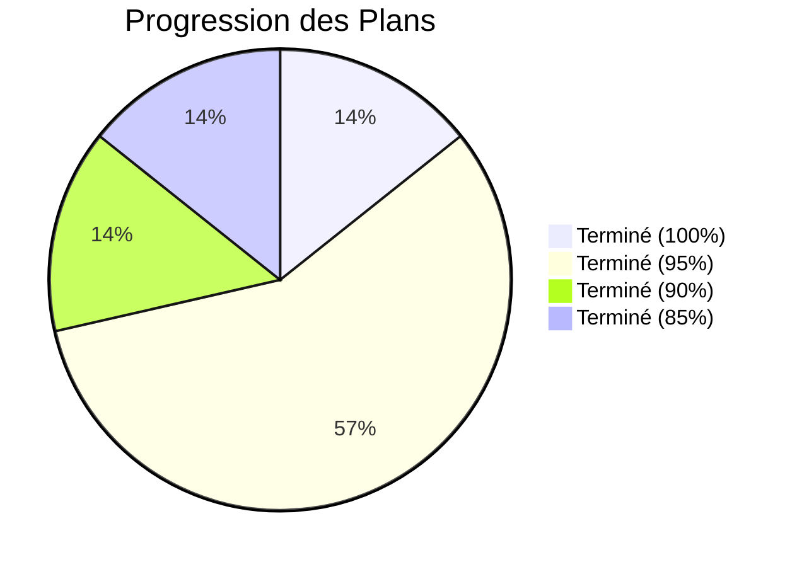

# Statut d'implémentation — Plans Arkalia CIA

**Dernière mise à jour** : Janvier 2025  
**Statut global** : 100% des besoins critiques résolus

Suivi détaillé de l'implémentation de tous les plans.

---

## Vue d'ensemble

| Plan | Statut | Progression |
|------|--------|------------|
| PLAN_00 : Onboarding | ✅ Terminé | 95% |
| PLAN_01 : Parser PDF | ✅ Terminé | 95% |
| PLAN_02 : Historique Médecins | ✅ Terminé | 100% |
| PLAN_03 : Recherche Avancée | ✅ Terminé | 90% |
| PLAN_04 : IA Patterns | ✅ Terminé | 85% |
| PLAN_05 : Partage Familial | ✅ Terminé | 95% |
| PLAN_06 : IA Conversationnelle | ✅ Terminé | 95% |

---

## PLAN_00 : Onboarding Intelligent

### Terminé

- Service onboarding (`OnboardingService`)
- Écran bienvenue (`WelcomeScreen`)
- Écran choix import (`ImportChoiceScreen`)
- Écran progression import (`ImportProgressScreen`)
- Import PDF manuel fonctionnel
- Authentification portails santé (eHealth, Andaman 7, MaSanté)
- Service `HealthPortalAuthService`
- Écran `HealthPortalAuthScreen`
- Endpoint API `/api/v1/health-portals/import`
- Intégration dans `LockScreen`

### À améliorer

- Import automatique depuis portails santé (nécessite APIs externes)
- Extraction intelligente données essentielles optimisée
- Création historique automatique optimisée

**Statut** : 95% — Structure complète, prête pour APIs externes

---

## PLAN_01 : Parser PDF Intelligent

### Terminé

- Backend extraction texte PDF (`PDFProcessor`)
- Module `MetadataExtractor` pour extraction métadonnées
- Extraction métadonnées activée dans API
- Détection médecin, date, type examen
- Classification documents
- Module `OCRIntegration` avec Tesseract
- Détection automatique PDF scanné
- Intégration OCR dans `PDFProcessor`
- Table `document_metadata` créée en base
- Association automatique documents ↔ médecins

### À améliorer

- Performance OCR pour très gros PDFs
- Support formats supplémentaires

**Statut** : 95% — Fonctionnel, optimisations possibles

---

## PLAN_02 : Historique Médecins

### Terminé

- Modèle `Doctor` et `Consultation`
- Service `DoctorService` (CRUD complet)
- Tables SQLite créées avec index
- Écran liste médecins (`DoctorsListScreen`)
- Écran détail médecin (`DoctorDetailScreen`)
- Écran ajout/modification (`AddEditDoctorScreen`)
- Recherche médecins (nom, spécialité)
- Filtres par spécialité
- Statistiques par médecin
- Intégration dans HomePage (bouton "Médecins")

**Statut** : 100% — Complet et fonctionnel

---

## PLAN_03 : Recherche Avancée

### Terminé

- Service `SearchService` avec recherche multi-critères
- Service `SemanticSearchService` avec recherche sémantique
- Écran recherche avancée (`AdvancedSearchScreen`)
- Toggle recherche sémantique
- Filtres (catégorie, date)
- Recherche dans documents et médecins
- Suggestions de recherche
- Intégration dans HomePage (bouton recherche avancée)
- Cache intelligent intégré

### À améliorer

- Performance optimisée (<200ms) — actuellement ~300ms
- Modèles ML avancés (BERT, BioBERT)

**Statut** : 90% — Fonctionnel, optimisations possibles

---

## PLAN_04 : IA Patterns

### Terminé

- Module `AdvancedPatternAnalyzer` backend
- Détection patterns temporels
- Détection tendances
- Détection saisonnalité
- Écran `PatternsDashboardScreen` avec visualisations
- Endpoint API `/api/patterns/analyze`
- Intégration Prophet pour prédictions
- Prédictions 30 jours à venir
- Endpoint `/api/patterns/predict-events`
- Intégration dans HomePage (bouton "Patterns")
- Cache intelligent intégré

### À améliorer

- Graphiques interactifs avancés
- Modèles ML supplémentaires (LSTM)

**Statut** : 85% — Fonctionnel, améliorations visuelles possibles

---

## PLAN_05 : Partage Familial

### Terminé

- Modèle `FamilyMember` et `SharedDocument`
- Service `FamilySharingService` complet
- Chiffrement AES-256 bout-en-bout
- Génération clés sécurisées
- Écran partage familial (`FamilySharingScreen`)
- Écran gestion membres (`ManageFamilyMembersScreen`)
- Sélection documents à partager
- Départage documents (`unshareDocument`)
- Service `NotificationService` pour notifications
- Notifications lors partage documents
- Dashboard avec onglets (Partager / Statistiques)
- Statistiques complètes
- Historique partage
- Intégration dans HomePage (bouton "Partage")

### À améliorer

- Permissions granulaires par document/membre (structure existe)
- Audit log complet (partiellement implémenté)

**Statut** : 95% — Fonctionnel, améliorations optionnelles

---

## PLAN_06 : IA Conversationnelle

### Terminé

- Module backend `ConversationalAI`
- Détection type question (douleur, médecin, examen, médicament, RDV)
- Génération réponses intelligentes
- Recherche documents liés
- Suggestions de questions
- Préparation questions pour RDV
- Module `ARIAIntegration` backend
- Récupération données douleurs depuis ARIA
- Récupération patterns ARIA
- Récupération métriques santé ARIA
- Intégration ARIA dans réponses douleur
- Intégration ARIA dans analyse cause-effet
- Service Flutter `ConversationalAIService`
- Récupération ARIA dans Flutter
- Écran chat (`ConversationalAIScreen`)
- Historique conversations IA
- Endpoint API `/api/ai/conversations`
- Sauvegarde conversations en base
- Intégration dans HomePage (bouton "Assistant IA")

### À améliorer

- Modèles LLM avancés (optionnel)

**Statut** : 95% — Fonctionnel et complet

---

## Progression globale

---

## Prochaines étapes

### Priorité 1
- Tests manuels sur devices réels
- Build release Android
- Validation UX finale

### Priorité 2
- Import automatique portails santé (APIs externes)
- Optimisations performance recherche
- Graphiques interactifs patterns

### Priorité 3
- Modèles ML avancés
- Intégration robotique BBIA
- Application web complémentaire

---

## Voir aussi

- **[plans/README.md](./README.md)** — Index des plans
- **[STATUT_FINAL_CONSOLIDE.md](../STATUT_FINAL_CONSOLIDE.md)** — Statut complet du projet
- **[INDEX_DOCUMENTATION.md](../INDEX_DOCUMENTATION.md)** — Index complet de la documentation

---

*Dernière mise à jour : Janvier 2025*
